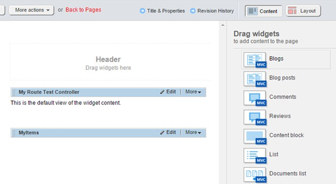

Sitefinity Feather
------------------

> The *Sitefinity Feather* module is a collection of resources and
> conventions to simplify the creation and management of widgets,
> layouts, and templates. Feather allows you to use convention-based,
> mobile-first UI frameworks with your Sitefinity site. The most popular
> of all these frontend frameworks is Bootstrap, but Feather also
> supports other frontend framework such as Semantic UI and Foundation.
>
> Feather is a free module, built into Sitefinity and is enabled by
> default on new Sitefinity installations. Feather adds a complete
> framework to take control the site's layout and markup. In this
> section we'll review a few of the features relevant to designers
> provided by Feather.
>
> **Note**: Although the technology behind Feather is the ASP.NET MVC
> development framework, the features available to designers involve
> little to no programming effort and can be leveraged by following the
> required conventions which we'll look at in the next section.
>
#### MVC Stock Widgets

> Feather includes a collection of MVC versions of the stock Sitefinity
> widgets such as Blogs, News, Events, etc. These versions are
> lightweight, mobile-friendly, and load quickly with efficient, clean
> markup and can be differentiated from the default widgets in the
> toolbox by the MVC icon in the corner.

> On the backend, the widget designers for the MVC widgets are also
> driven by Feather, resulting in a faster, sleeker interface for your
> content editors.

> Feather isn't just limited to stock modules. Custom dynamic modules
> created by the module builder also get their own MVC Feather widgets,
> all of which are built with the same mobile-first, responsive design.

#### Widget Designer Framework

> You can create custom widget designers using a brand new framework
> based on AngularJS. Included is a wide assortment of Angular
> Directives that make it simple to enable Sitefinity related field
> controls to your designer, including selectors for Pages, Images,
> Documents and even your custom module items.
>
> The extensibility of widget designers offered by Feather also enables
> you to tap into a rich style collection to simplify your design, and
> even allows you to add custom commands to your widget beyond the
> included Editor.

#### Convention-based customization
>
> Feather offers an intuitive convention for customizing and creating
> widget and layout templates. Simply create a file in the proper
> location and the MVC widgets and designers will have immediate access
> to the new templates.
>
> The Bootstrap template package is included out of the box, and
> additional packages supporting Foundation and Semantic UI are also
> available via
> [GitHub.](https://github.com/Sitefinity/feather-packages) You can even
> create your own packages to reuse across multiple Sitefinity websites.
> Sitefinity Page Templates are created from these packages
> automatically, so you can immediately benefit from the new MVC layouts
> on your pages.
>
#### Templating via Routing

> Feather uses a clever routing technique to make it easy to decide
> which templates to override and from where. Templates assigned from a
> Resource Package have the highest priority, then fall back to the root
> Mvc folder and finally back to the embedded resources, allowing you to
> override some or all templates by simply creating a file in the
> appropriate location.
>
#### Layout Widget Templates

> Another feature enabled by the Feather module is the set of layout
> templates from the different UI Resource Packages (Bootstrap,
> Foundation, Semantic UI). These are found in the Template section of
> the sidebar of the page editor, and allow you to apply grids and
> columns to your pages, based on the framework of your choice.

#### Resource Packages

> Layout templates are actually sourced from a folder in the Sitefinity
> project root named ResourcePackages. Within each package folder is a
> collection of templates that can be automatically assigned to your
> pages, widgets, and designers associated with the pages created using
> the package.
>
> In addition to containing templates, ResourcePackages can also contain
> the styles, scripts, images and other content required to style your
> page. By following a simple naming convention, your page templates
> will automatically be enhanced by the appropriate package.

