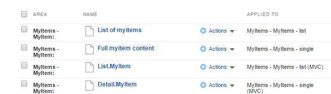

Creating Page Templates from MVC Layout Files
---------------------------------------------

Feather allows you to create Page Templates in the backend based on an
MVC layout file (instead of the usual Webforms Master Page). Simply
place a layout file in the appropriate Mvc folder and Feather will
automatically create the associated Sitefinity page template.

You can then extend the template, adding new ContentPlaceHolders and
other markup by modifying the appropriate backing layout file.

To demonstrate this, we'll create a new template based on this example
MVC layout file, named MyMvcTemplate.cshtml

> \@using Telerik.Sitefinity.Frontend.Mvc.Helpers
>
> \<!DOCTYPE html\>
>
> \<html xmlns=\"<http://www.w3.org/1999/xhtml>\"\>
>
> \<head\>
>
> \<title\>\</title\>
>
> \</head\>
>
> \<body\>
>
> \<h1\>Template based on Layout file by convention\</h1\>
>
> \

>
> \@Html.SfPlaceHolder(\"Contentplaceholder1\")
>
> \@Html.SfPlaceHolder(\"Contentplaceholder2\")
>
> \@Html.SfPlaceHolder(\"Contentplaceholder3\")
>
> \</div\>
>
> \</body\>
>
> \</html\>
>
Notice that the layout template defines the full structure of the HTML
page, and also includes placeholders via the \@Html.SfPlaceholder
helper method. These placeholders correspond to the droppable widget
areas on the Sitefinity template.

First, in the project folder for your site navigate to the location
\~/Mvc/Views and create a folder named **Layouts**. Then create a file
named MyMvcTemplate.cshtml and place it in the Layouts folder, so that
the full path to the file is

\~/Mvc/Views/Layouts/MyMvcTemplate.cshtml.

In the Sitefinity Administration Backend, navigate to *Design \> Page
Templates*, revealing the new template in the list, automatically
added and named to match the layout file.

Opening the template reveals the three content placeholders, into
which you can place any of the Mvc Feather widgets. Since we're using
a custom layout (and not a Resource Package), these widgets will use
the default markup of the embedded Feather templates.

These can then be customized by creating the appropriate template
files in the Mvc folder. We demonstrate this in the section
Customizing the Built-in Widget Templates.

Using Page Templates from Resource Package Layouts
--------------------------------------------------

Within the included Bootstrap ResourcePackage is at least one MVC
layout file, and these files also automatically generate a
corresponding Sitefinity Page Template in the backend. When using the
Bootstrap template (or any ResourcePackage template), all Feather MVC
widgets placed on that template (or pages based on the template)
automatically inherit the templates defined in that package instead of
serving the default embedded ones in the Feather package.

To demonstrate this, we'll create a new Sitefinity Page from the
default Bootstrap template, located in the path

*\~/ResourcePackages/Bootstrap/Mvc/Views/Layouts/default.cshtml.*

1.  In the Administration Backend, navigate to Pages.

2.  Click the *Create a Page* button.

3.  Name the page "My Bootstrap Page".

4.  From the section of templates labeled with the header "Bootstrap"
    select the one named "default".

Since this layout is defined to use the Bootstrap resource package, any MVC widgets added will automatically
load the templates from that folder, matching the look and feel of the
bootstrap style and typography.

You can further customize these by creating the appropriate template
files in the Resource Package folder. This is demonstrated in the
section Customizing the Built-in Widget Templates

Working with Feather Widgets
----------------------------

We've already seen that enabling Feather adds a complete assortment of
MVC widgets for the Sitefinity stock and dynamic modules. In this
section we'll see how we can customize these using the file path
conventions of Feather.

#### Note: 
For information on creating your own widgets that leverage
the MVC Framework, see the Sitefinity Developers Workshop on Github.

Customizing the Built in Widget Templates
-----------------------------------------

If you are not using Resource Packages and have no custom templates
for any widgets, Feather will default to serving the embedded
templates in the Feather module library. The templates are presented
for selection when you edit a widget in the page editor. If no custom
templates exist, only the default one is available for selection.

However, because these templates are served from the Feather library,
they are static and cannot be modified. Instead, you can create your
own custom templates, to be served instead of the defaults. There are
two ways to manage these: either in the Sitefinity Widget Template
editor in the Administration Backend, or by creating actual files that
follow the Feather file path conventions.

Order of Virtual Path Resolution
--------------------------------

As previously mentioned, there are several locations from which widget
templates can be served using Feather, with rules that prioritize some
locations over others. Here is the list of possible places from the
highest priority (served first) to the lowest (served when no other
higher-priority templates exist):

-   **ResourcePackages**: If the backing Page or Page Template that
    contains the widget is based on an MVC template from a Resource
    Package, it will first search the Mvc folder of that package on the
    file system and serve the matching templates for each widget found
    in that location. If you are not using a Resource Package template,
    this area is skipped and not searched.

-   **Root Mvc folder**: If no matching templates are defined in the
    Resource Package Mvc folder (or if the template is not based on a
    Resource Package) Feather will attempt to locate views in the root
    \~/Mvc/Views folder of the web application.

-   **Sitefinity Widget Templates**: If no matching templates are
    defined in the file system, Feather will then search for a matching
    template in the backend list of templates (located under the
    Design \> Widget Templates menu).

-   **Embedded Resources**: Finally, if no custom templates are found in
    any of the custom locations, Feather will serve the default,
    embedded resources from the Feather module itself.

Creating Templates in the Sitefinity Backend
---------------------------------------------

Sitefinity maintains a list of widget templates that are stored in the
database so you can manage them from the backend. These are listed in
the section found under Designers

Widget Templates
-----------------

By default, Sitefinity does not provide custom MVC templates for stock
widgets, so the list is initially populated only with templates for
the standard (Webform) widgets.

Creating new templates for MVC widgets requires that you follow the
naming convention for the widget, by prefixing the name of the
template with the type of view to which it is assigned in the format
{ViewType}.{TemplateName}.

This name must also identify the type of view being shown, for example
List.MyTemplate would represent a template for the list view, while
Detail.MyTemplate would represent another template for the details
page.

We'll demonstrate this by creating new MVC templates for the News
widget. For the markup we'll use a copy of the template files from the
Bootstrap resource package (located in the folder
\~/ResourcePackages/Bootstrap/MVC/Views/News).

Here is the markup for the list view, modified with a custom title to
differentiate from the default template.

> \@model Telerik.Sitefinity.Frontend.Mvc.Models.ContentListViewModel
>
> \@using Telerik.Sitefinity.Frontend.Mvc.Helpers;
>
> \@using Telerik.Sitefinity.Modules.Pages;
>
> \@using Telerik.Sitefinity.Web.DataResolving;
>
> \<h1\>My Custom List View\</h1\>
>
> \

>
> \<ul class=\"list-unstyled\"\>
>
> \@foreach (var item in Model.Items)
>
> {
>
> var navigateUrl = HyperLinkHelpers.GetDetailPageUrl(item,
> ViewBag.DetailsPageId, ViewBag.OpenInSamePage);
>
> \<li \@Html.InlineEditingAttributes(Model.ProviderName,
> del.ContentType.FullName, (Guid)item.Fields.Id)\>
>
> \<h3\>
>
> \<a \@Html.InlineEditingFieldAttributes(\"Title\", \"ShortText\")
> href=\"\@navigateUrl\"\>\@item.Fields.Title\</a\>
>
> \</h3\>
>
> \<div\>
>
> \
>
> \@item.GetDateTime(\"PublicationDate\", \"MMM d, yyyy, HH:mm tt\")
>
> \@Html.Resource(\"By\")
>
> \@DataResolver.Resolve(item.DataItem, \"Author\", null)
>
> \</span\>
>
> \@Html.CommentsCount((string)navigateUrl, item.DataItem)
>
> \</div\>
>
> \
 \"ShortText\")\>
>
> \@Html.Raw(item.Fields.Summary)
>
> \</div\>
>
> \<a href=\"\@navigateUrl\"\>\@Html.Resource(\"FullStory\")\</a\>
>
> \</li\>
>
> }
>
> \</ul\>
>
> 172 \| DESIGNERS
>
> \@if (Model.ShowPager)
>
> {
>
> \@Html.Action(\"Index\", \"ContentPager\", new
>
> {
>
> currentPage = Model.CurrentPage, totalPagesCount =
> Model.TotalPagesCount.Value,
>
> redirectUrlTemplate = ViewBag.RedirectPageUrlTemplate
>
> })
>
> }
>
> \</div\>
>
And here is the markup for the details view, again slightly modified:

> \@model Telerik.Sitefinity.Frontend.Mvc.Models.ContentDetailsViewModel
>
> \@using Telerik.Sitefinity.Frontend.Mvc.Helpers;
>
> \@using Telerik.Sitefinity.Web.DataResolving;
>
> \<h1\>My Custom Detail View\</h1\>
>
> \

> \@Html.InlineEditingAttributes(Model.ProviderName,
> Model.ContentType.FullName, (Guid)Model.Item.Fields.Id)\>
>
> \<h3\>
>
> \
>
> \@Model.Item.Fields.Title
>
> \</span\>
>
> \</h3\>
>
> \<div\>
>
> \
>
> \@Model.Item.GetDateTime(\"PublicationDate\", \"MMM d, yyyy, HH:mm
> tt\")
>
> \@Html.Resource(\"By\")
>
> \@DataResolver.Resolve(\@Model.Item.DataItem, \"Author\", null)
>
> \</span\>
>
> \@Html.CommentsCount(\"\", \@Model.Item.DataItem)
>
> \</div\>
>
> \

>
> \@Html.Raw(Model.Item.Fields.Summary)
>
> \</div\>
>
> \

>
> \@Html.Raw(Model.Item.Fields.Content)
>
> \</div\>

> \@if (Model.EnableSocialSharing)
>
> {
>
> \@Html.SocialShareOptions()
>
> }
>
> \@Html.CommentsList(\@Model.Item.DataItem)
>
> \</div\>

The following steps walk you through creation and assignment of the widget templates.

1.  Click the *Create a template* button.

2.  In the following screen select the option for *News (MVC)*.

3.  Copy and paste the markup from the above template into the editor.

4.  Make sure the name of the template is prefixed with "List." followed
    by a unique name.

5.  Leave the name for developers at its default value.

6.  Click *Create this template*.

7.  Repeat steps 1-6, using the prefix "Detail." in step 4.

8.  Open or create a page in the Page Editor to contain the news widget.

9.  From the toolbox, drag the News widget with the MVC icon into a
    placeholder.

10. Click *Edit* in the newly placed widget to open its property editor.

11. Click the header for List settings, revealing the custom template
    option.

12. Select this template.

13. Click the header for Single item settings, revealing the custom
    template option.

14. Select the custom template.

15. Click *Save*.

Creating Templates in the File System
-------------------------------------

While the widget templates section in the Sitefinity backend offers a
quick and easy way to manage templates, it lacks Intellisense and the
version control benefits offered by working with actual files.
Fortunately, by following the Feather naming convention you can manage
your templates as files in your project.

The naming convention requires that you place the view in a folder
that matches the name of the widget (such as "News", "Events",
"VideoGallery", etc.) and name the file to match the type of view
being served. For example, if you are creating a custom template for
the News widget list view named "MyTemplate", you would name the file
*List.MyTemplate.cshtml*.

There are two locations into which you can place templates, depending
on whether or not you are using ResourcePackage layouts. If the page
on which you are adding the widget is based on a Sitefinity Page
Template using a ResourcePackage layout, you would place your custom
template in the subfolder of the ResourcesPackage that matches the
package being used.

#### Note: 
Although you can edit the existing Resource Package
templates, this is not recommended, as they may be overwritten when
upgrading Sitefinity or Feather. It is recommended that you create
custom templates instead of modifying the default ones.

To demonstrate this, we'll create a custom template for the News
widget list view for a page that is using the Bootstrap Resource
Package by duplicating and renaming the existing template.

1.  In Visual Studio Solution explorer, navigate to the path

 *\~/ResourcePackages/Bootstrap/MVC/Views/News*.

2.  Right click the file named *List.NewsList.cshtml* and select *Copy*.

3.  Right-click the parent News folder and select Paste.

4.  Rename the file to *List.MyBootstrapTemplate.cshtml*.

5.  Open the newly created file and make changes to differentiate it
    from the default template.

6.  Create or open a Sitefinity page which uses a Bootstrap template,
    and add the MVC News widget.

7.  Click *Edit* on the widget to open the property page.

8.  Click the *List Settings* header, revealing your new template in the
    *List template* dropdown.

9.  Select the new template and click *Save*.

If your site is not using a Resource Package for layout, you can still
create custom templates for MVC widgets. Instead of placing the files
in the ResourcePackages folder, place them in the root MVC folder.

We'll demonstrate this by creating a custom template for the NewsList
template for a regular Sitefinity page. We'll use the same file from
the Bootstrap package as a starting point.

1.  In Visual Studio Solution explorer, navigate to the path

 *\~/ResourcePackages/Bootstrap/MVC/Views/News*.

2.  Right click the file named *List.NewsList.cshtml* and select *Copy*.

3.  Navigate to the folder *\~/MVC/Views* and create a new folder named
    *News*.

4.  Right click this folder and select *Paste*.

5.  Rename the file to *List.MyCustomTemplate.cshtml*.

6.  Open the newly created file and make changes to differentiate it
    from the default template.

7.  Create or open a Sitefinity page which does not use a Resource
    Package template, and add the MVC News widget.

8.  Click *Edit* on the widget to open the property page.

9.  Click the *List Settings* header, revealing your new template in the
    *List template* dropdown.

10. Select the new template and click *Save*.

Notice that in this case we did not see the Bootstrap version of the
template in the list. The Resource Package templates are only revealed
by Feather if the host template is assigned to a layout file from the
same package. In this case, we were working with a standard blank
template, so the naming convention will check the root MVC folder
instead (see Order of Virtual Path Resolution for more details).

Feather Widgets for Custom Modules
----------------------------------

Sitefinity Feather also supports custom modules built with the Module
Builder. When Feather is installed, it automatically generates an MVC
widget in the page editor toolbox for any new modules you create.

In this screenshot, I've created a new module called *MyItems*.
Feather automatically created a matching section in the toolbox,
allowing me to drag the content widget for this module onto the page.

The generated widget has properties similar to all the standard
Sitefinity widgets, which you can manage by opening the widget
properties editor. This allows you to specify the standard properties
you expect, such as filtering items, as well as styling both the list
and details views for displaying items from the module.

Editing Custom Module Widget Templates
--------------------------------------

In addition to creating a widget specific for your module, Feather
also generates default templates for List and Detail views. You can
view and edit these templates in the Sitefinity backend by navigating
to *Design \> Widget Templates*.

Notice that you get both the standard WebForms version as well as the
new Feather-friendly MVC templates. Also, the naming of the templates
must match the expected convention (List.MyItems and Detail.Myitems)
so that they are presented appropriately for selection in the widget
properties.

Click to open the *List.MyItem* template, revealing the markup for
that view. You can manage the markup here, accessing the properties of
the content item using the pattern *item.Fields.\<FieldName\>* where
FieldName matches exactly the name of the custom field you wish to
show. For example, *\@item.Fields.Title* in the screenshot below.

If the default widget templates are not sufficient to meet your needs
you can create additional ones with this editor, as well as in your
Visual Studio solution, by following the same naming and path
conventions as discussed in the previous section.
