Page Templates
--------------

Page templates allow you to have the same basic layout and content
across multiple pages. For example, you may want certain pages to have
the organization logo in the upper left hand corner and a Logo
notice centered at the bottom of the page. You can build all of your
page templates entirely in Sitefinity, using drag and drop, without
having to use any other tool.

#### Note: 
Page Templates can also be created from master pages (Web Forms) and from
MVC layout files

Access page templates from the *Design \> Page Templates* menu option. 
The list shows built-in templates that can be
used as starting points.

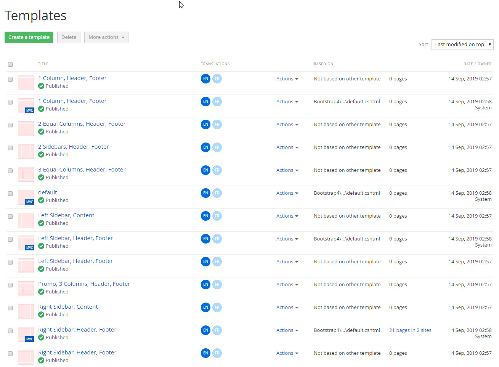

The *Title* column opens the template for editing, bypassing the
*Actions* menu.

The *Actions* menu has options to delete the template, change the
title, change the content (edit the template), change permissions and
select a new base template (choose a template as a starting point).

The *Based On* column shows if the template inherits from some other
template or is completely new.

To the right of Based On, a column shows the number of pages that use
this particular template. You can click this link to see a list of
pages that use the template and to preview those pages.

#### Creating a New Template

This walk-through demonstrates creating a new page template and
applying the new template to a page. The template will include an
organization logo, language selector drop-down, navigation menu and
footer with a Logo.

1.  Click the *Create a template* button and enter information about the template

Enter the Name of the template. The name should describe how the template is used.

Optionally, you can specify a thumbnail image for the template. The
recommended size is 260 x 240 pixels.

2.  Select the Use template option. Click the *Select another Template*
    button to choose the 1 Column, Header, Footer template.

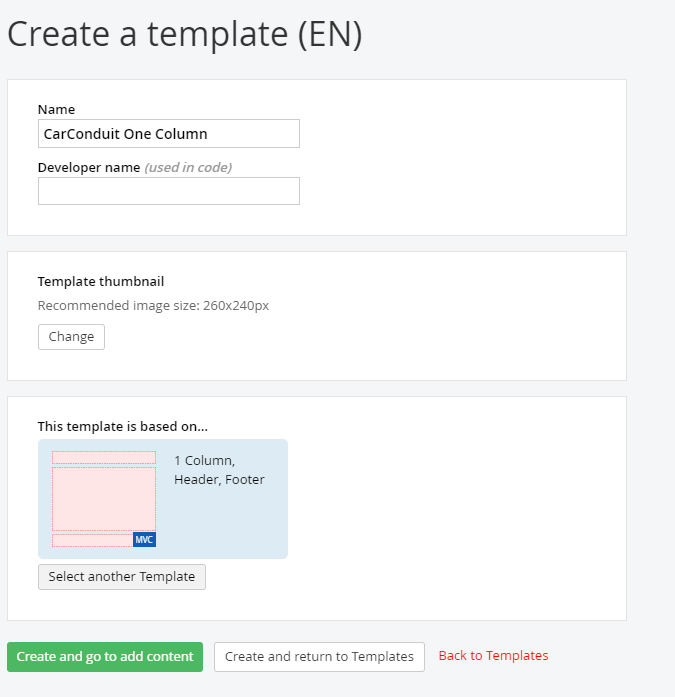

3.  Click the *Create and return to Templates* button. The new template
    shows up in the list and the Based On column shows that we\'re using
    the 1 Column Header, Footer template as a starting point.

#### Editing the Template Layout

Now that the page template is created, you can fine-tune the template
layout. This will create the zones that widgets can be dropped into,
define proportions of areas within layout elements, and define
"wrapper" names that can be referred to later in CSS.

1.  Click the *Actions \> Content* option (or click the title) to edit
    the template.

2.  Click the *Layout* button. You should see the layout elements from
    the template that this page template is based on.

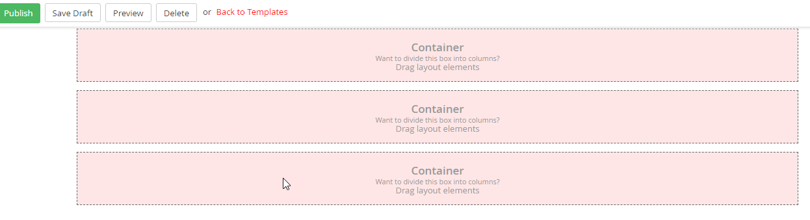

3.  From the *Drag layout elements* area of the right hand menu, drag
    the Grid 3 + 9 element onto the top row of the layout. This should
    land right on top of the existing layout element.

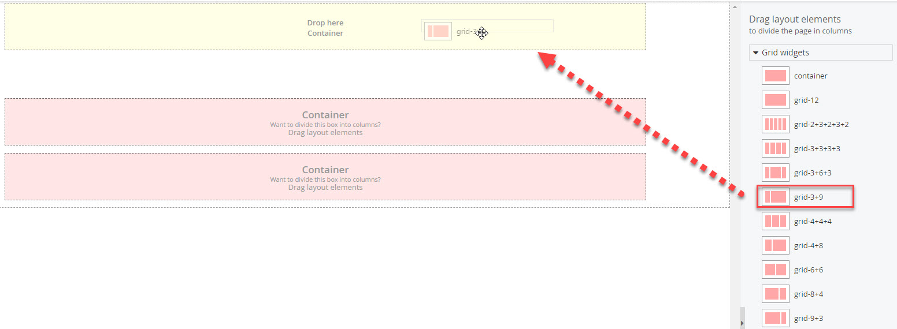

4.  Now the layout should look something like the screenshot below,
    where the top row is divided into proportions of 25% and 75% as a Bootstrap layout made out of 12 boxes of equal size.

5.  Click the *Edit* button, click on *Classes* and enter "ccLogin" to Column 2 (this will be the name of the CSS class you want to apply to the Login placeholder). In the
    *Labels* tab, enter "Logo" for Column 1 and "Login" for Column 2. Click the *Save* button to finish editing the layout element.

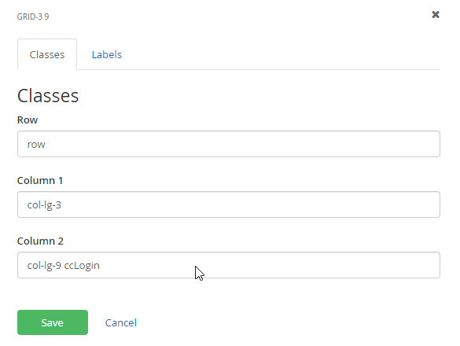 

6.  Drag the Grid-12 layout element to a point just between the top and
    second rows. This will create a new row in the Header area of the
    layout.

7.  Click the *Edit* button, click on *Labels* and enter "Menu" as the Column 1 label. Click the *Save* button.

8.  Drag a Grid-12 layout element to the Content area below the menu.

9.  Click the *Edit* button, click on *Labels* and enter "Main" as the Column 1 label. Click the *Save* button.

10. Drag a Grid-12 layout element to the Footer area below the content.

11. Click the *Edit* button, click on *Labels* and enter "Footer" as the Column 1 label.

The layout should look like the screenshot below. Notice that the
layout elements have the custom labels that you defined.

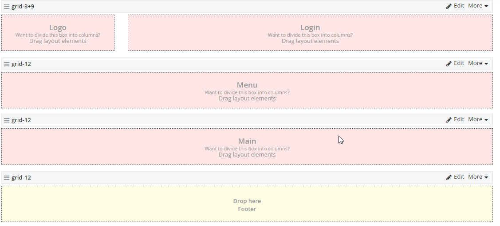

#### Editing the Template Content

Once the layout has been determined, you can add the widgets and
content that will appear on any page that uses this page template.

1.  Click the *Content* button. Notice that the layout area layouts in
    this view.

2.  Drag an Image widget to the Logo area.

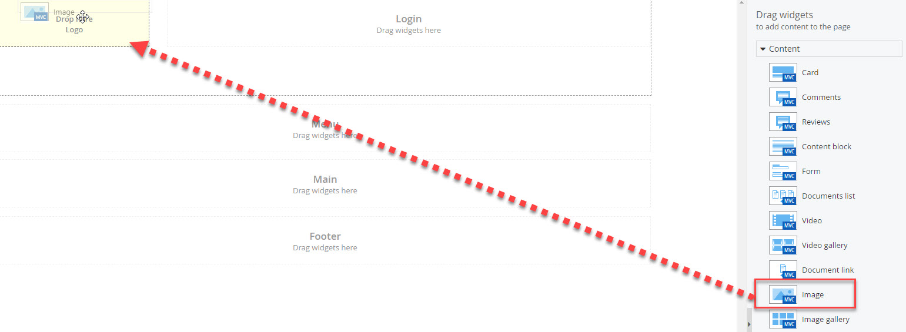

3.  Click the *Edit* link.

4.  In the Image dialog, click the *Select image* link, select a logo
    image and click the *Done* button. Click the *Settings* link. Select
    the *Image Size* drop down and select *Small: 240px width* from the
    list. Click the *Save* button.

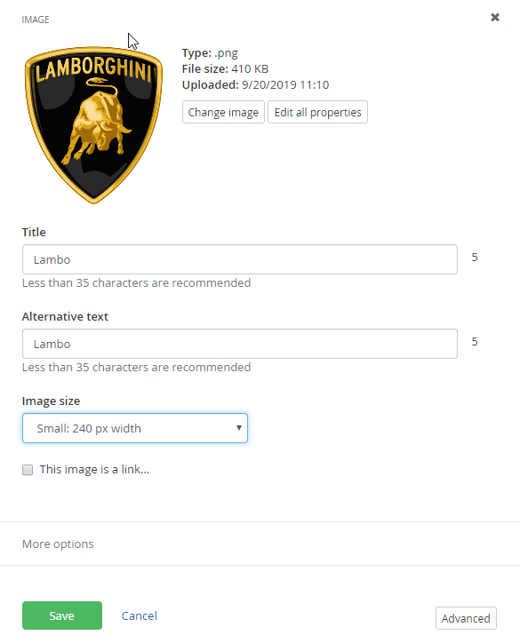

5.  Open the Login section of the right-hand menu and drag the *Login/Logout button* widget to the Login layout area.

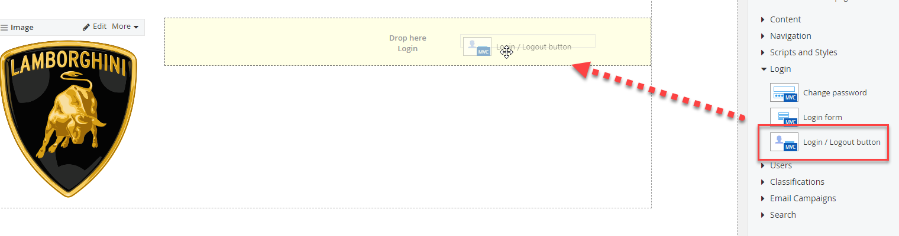

6.  Click the *Edit* link of the Login name widget. Scroll down to the
    Template property and change it to *Login name*. Click the *Save* button.

The page now displays something like the screenshot below.

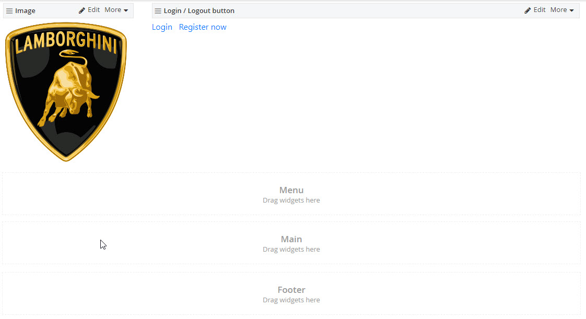

#### Note: 
The Login name should float to the right in this layout. See
the Styling section for directions on how to use CSS styling.

7.  From Navigation area of the right-hand menu, drag a *Navigation*
    widget to the Menu layout element below the image and login.

8.  Click the *Edit* button of the Navigation widget. From the template
    drop down, select the *Horizontal* option. Click the *Save* button to close the dialog.

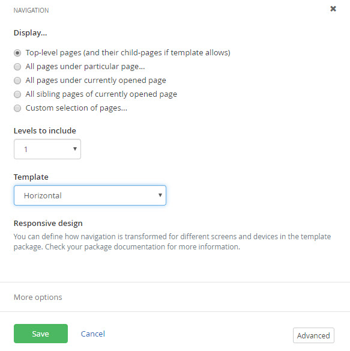

#### Note: 
What if you don\'t want to display the home page in the
navigation, but only the pages that come under home? The Display
section has an option to display all pages under a particular page.
Also, you can limit the number of levels to show by setting Levels to
include.

9.  Drag a *Content* block widget to the Footer layout area, at the
    bottom of the page.

10. Click the *Edit* link. Add a Logo notice for your organization,
    for example *Logo 2019 CarConduit.com*. Click the *More
    formatting* options button. 

11. Select the text in the editor window, then click the Align Center button.

12. Click the *Save* button. The page should now look like the screenshot below:

13. Click the *Publish* button.

#### Note: 
Widgets in a page template can be marked as editable so that
they can be tweaked later when they're on the page. For example, if
you edit the Logo content widget on the page template, drop down the *More*
menu and select the *Make editable on pages* option.

The widget title bar will display "EDITABLE ON PAGES" to flag the change.

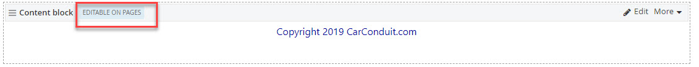

Now you have access to the Edit link even when the widget is used on
the page. You can change the content and the other settings for
the widget. **Be aware that the inheritance to the original widget will be broken so that changes to the original will not carry to the page where you edited the widget.**

Using the New Page Template
-----------------------------

Now that the page template is created and the layout designed, you can
create a new page using the template.

1.  Select the *Pages* menu option.

2.  Create a new page. Choose the new template we just created for this page

#### Note: 
You can return to an earlier version of any page, before a template was changed by selecting the *Revision History* item from the Actions menu.

When you edit the page content, the page appears with the template
layout and items already showing. Notice that the login name,
navigation menu and Logo all come from the template and
cannot be changed here. The Copyright at the bottom can be edited because we had *Editable in pages* enabled, so the *Edit* link is visible for that
template element only. You can add new items around the template
items, but you can\'t delete or sub-divide the layout elements.

Duplicating Page Templates
-------------------------

To cut down on repeated work, you can duplicate existing page templates. Any changes to the original page template are inherited by the duplicate. You can setup hierarchies of templates so that page elements are defined one time only. For example, you could define a base page with an organization logo. By duplicating the page, you get the organization logo for free.

To create a duplicate, start from *Design \> Page Templates*, then
click the Actions menu *Duplicate* option. Give the template a new
title and then select *Create and go to add content* or *Create and
return to templates*.

Be sure to think ahead about the page templates hierarchy. Try to keep
the initial templates simple with the minimum number of elements
needed. Think about the scenarios that might arise and try to design
your template hierarchy to allow flexibility and maintenance with the
least amount of upkeep.

Styling
--------

Custom changes to fonts, alignment, background and other appearance
changes needs to be applied using styles. Styles can be added:

-   Using the CSS (Cascading Style Sheet) widget. Styles can be added to
    the widget directly as text or you can link to a CSS file. (Please use CSS files and not inline CSS, PLEASE! :)

-   Using themes. Themes define a set of colors, fonts and CSS for the site.

You can use the CSS widget for quick, ad-hoc styling. You can have as
many CSS widgets on the page as you like. The styles defined in the
CSS widget are added automatically to the \<head\> tag of the page.

The last example shows the Login name widget text aligned left, much
too close to the logo graphic. The following walk-through demonstrates
adding a text-align style to the page and using the style in a Content
block widget.

1.  Select the *Design \> Page Templates* menu option.

2.  Open the CarConduit One Column template created in the previous
    Page Templates section.

3.  Drag a *CSS* widget to the page.

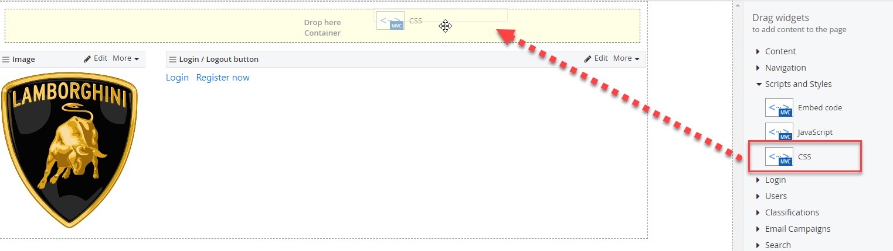

#### Note: 
Where you place the CSS widget is not critical to the
functioning of the page. The styles in the CSS widget are always added
to the page \<head\> tag. Multiple CSS widgets appear in the \<head\>
tag in the order they\'re placed on the page.

4.  Click the CSS widget *Edit* link.

Take a moment to explore the CSS dialog.

If you choose the *Link to a CSS file* option, you can browse to a
\*.css file within your project. In the Media section, you can select
one or more media types that the styles will apply to. CSS files
should be located in the \\App\_Themes folder.

The *Write CSS* option allows you to add styles directly to the page.
Styles can be added to the editor window, but be sure to leave out the
\<style\> tag.

5.  Select the *Write CSS* option and enter the style below to the window:

.ccLogin
{
  text-align:right;
}

6.  Click the *Save* button.

7.  Click the *Preview* button. The top row, right column text should align to the right side.

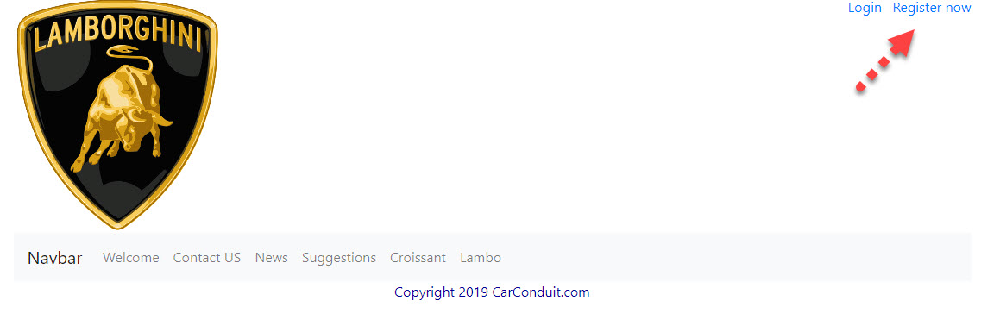

8.  Navigate back to editing the page and click the *Publish* button.

Create Templates from Master Pages (Legacy Web Forms Technique)
---------------------------------------------------------------

Master pages are a file-based standard that ASP.NET uses for
templating. Master pages also have C\# or VB.NET code-behind unlike
the Sitefinity template counterpart. Another advantage to master pages
is that you can reuse whatever frameworks the page is using without having to reconfigure
the page.

Here's a minimal example masterpage with content place holders for the
top, middle and bottom:

> \<%@ Master Language=\"C\#\" AutoEventWireup=\"true\"
> CodeFile=\"MyBasePage.master.cs\" Inherits=\"App\_Master\_MyBasePage\"
> %\>
>
> \<!DOCTYPE html\>
>
> \<html xmlns=\"<http://www.w3.org/1999/xhtml>\"\>
>
> \<head runat=\"server\"\>
>
> \<title\>CarConduit Master Page\</title\>
>
> \</head\>
>
> \<body\>
>
> \<form id=\"form1\" runat=\"server\"\>
>
> \<asp:ScriptManager ID=\"ScriptManager1\"
> runat=\"server\"\>\</asp:ScriptManager\>
>
> \<div\>
>
> \<asp:ContentPlaceHolder ID=\"TheTop\" runat=\"server\" /\>
>
> \</div\>
>
> \<div\>
>
> \<asp:ContentPlaceHolder ID=\"TheMiddle\" runat=\"server\" /\>
>
> \</div\>
>
> \<div\>
>
> \<asp:ContentPlaceHolder ID=\"TheBottom\" runat=\"server\" /\>
>
> \</div\>
>
> \</form\>
>
> \</body\>
>
> \</html\>
>
The master pages can be located in the *\\App\_Master* directory, a
sibling of the

*\\App\_Themes* directory. To run in Sitefinity, you must add a
ScriptManager control inside the form. The ContentPlaceHolder controls
show up in the Sitefinity page template editor as layout areas.

#### To use a master page as a page template:

1.  Click the *Pages* menu option.

2.  Click the *Create a page* button, and provide a name for the page.

3.  In the Template section, click the *Select another Template* button.

4.  Click the *Use your own master file* button.

5.  Select the master page from out of the App\_Master directory, then
    click the *Use Selected* button.

6.  Click the *Create and go to add content* button. The
    ContentPlaceHolder areas are shown here with their IDs showing.

**Next Topic:**
[Sitefinity Feather](./Feather/readme.md)
