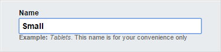
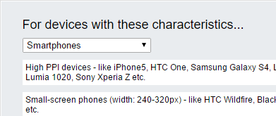
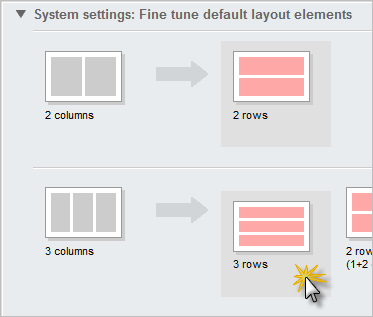
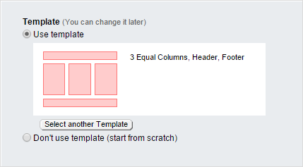
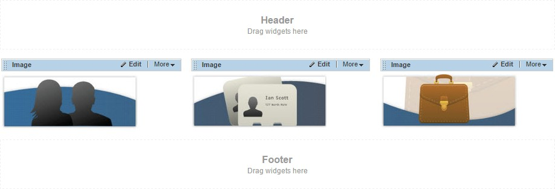
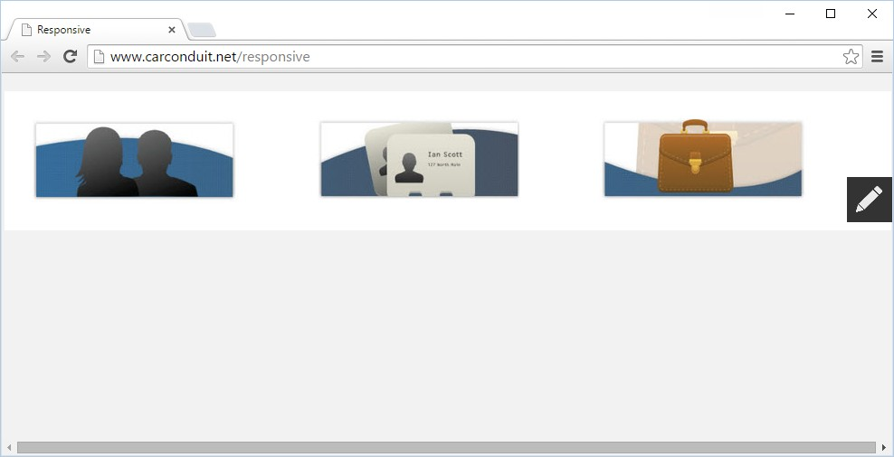
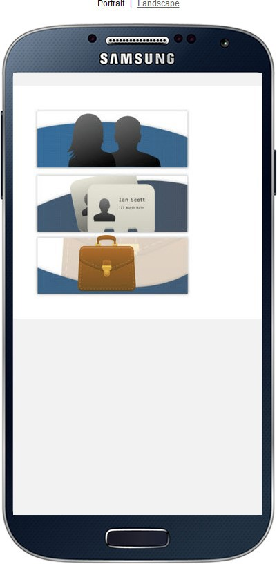
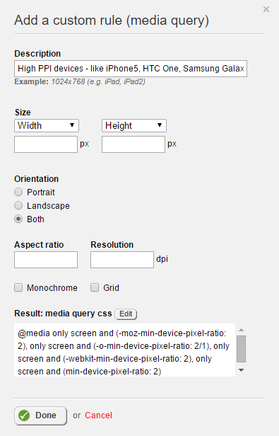
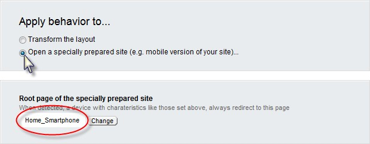
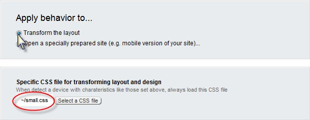

Responsive Design for Legacy Web Form Technology
------------------------------------------------

Your web design is expected to look good on standard desktop displays,
iPhones, Androids, tablets or any device used during the life of your
website. Sitefinity automatically arranges the layout of the screen
based on the current screen characteristics (i.e. screen size, device
to pixel ratio, orientation, etc.). If your large, browser-based
layout takes up three columns from side to side, the iPhone can view
the same content running in a single column. You can even customize
font properties or swap images based on the current screen
characteristics.

Sitefinity implements responsive web design automatically, using rules
to define the characteristics to look for (e.g. 240-320 pixels in
width like the HTC Wildfire) and how your site should react (e.g.
transform the layout, redirect to another site, or load a special
CSS).

Under the hood, Sitefinity uses CSS media queries to get information
about the screen minimum width and orientation. For more background
information, check out Ethan Marcotte\'s seminal blog [Responsive Web
Design](http://www.alistapart.com/articles/responsive-web-design/)

Creating Rules
--------------

The first step is to create rules for the scenarios you expect to
encounter. In our example, we\'ll create a small version of a simple
website. You can make rules for as many detailed cases as you want.
Typically, you\'ll want to cover small \"Smart phone\" screens,
tablets and large notebook/desktop screens.

To begin building a responsive web site, first create the group rules
and the layout that should result.

1.  From the Sitefinity menu, select *Design \> Responsive & Mobile*
    design.

2.  Click the *Create a group of rules* button.

3.  Enter a *Name* for the group of rules.

4.  Select device characteristics using the presets from the drop-down
    list. For this example, choose the *Smartphones* option.

5.  Leave the defaults for *Apply behavior to\...* and Specific CSS file
    options.

6.  In the *System settings* section, select the vertical arrangement of
    rows for each option. For example, where the default is *3 colum*ns,
    select *3 rows*.

7.  Leave the *This group of rules is active* checkbox selected and
    click the *Done* button.

To test this, we can create a new page with a three-column layout,
then look at the page preview and simply resizing the browser. First
create a new page that uses the *3 Equal Columns, Header, Footer*
template.

Add three Image widgets, one for each column. Populate the Image
widgets with any images you have available.

You can test the responsive design simply by resizing the browser. The
images display side-by-side, horizontally, as long as the browser is
wide enough.

Reduce the width of the browser, and the responsive rule for *Small*
kicks in. *Small* is configured to transform the layout from 3 columns
to 3 rows when the browser is narrower than a smart phone.

To get a better feel for how your page will look in a phone or tablet,
click the *More actions \> Preview for Smartphones & Tablets* option.

The preview shows how the page appears in iPhone, iPad, Samsung, Blackberry, Nokia and an ever-growing list of devices as they come on the market. You can also toggle the view between portrait or landscape orientations.

Device Characteristics
----------------------

Sitefinity predefines a set of device characteristics that will
trigger layout changes. The likely suspects are listed there, but you
can add your own custom rules to help \"future proof\" your site.

Click the *Details* button next to the \"High PPI devices\" entry to
configure the specifics that make up each rule. You can trigger rules
based on the size or size range, orientation, aspect ratio and
resolution. You can even trigger rules if the device is an old-school
monochrome or grid-based device, e.g. teletypes, terminals or portable
devices with limited display capabilities. As you change the settings,
a CSS media query is built dynamically in the *Result* area at the
base of the dialog.

Adding New Behaviors
--------------------

Changing layout gets you part way there, but you may need to perform
detailed styling of fonts, hide or show images, change margins or
obscure elements that don\'t work with a particular device. There are
two ways to handle these detailed changes, either transform the layout
or navigate to an entirely different page.

The *Open a specially prepared site* option (e.g. a mobile version of
your site) is less flexible than using style sheets and may result in
multiple sites being created as new device types come online. The
advantage is that you can customize the site very specifically for
each device type. To go this route, select the *Open a specially
prepared site* option, then select the Root page of the specially
prepared site.

If you select Transform the layout, you can choose a CSS file that
will come into play when certain devices are detected.

Using a CSS file option, the page is still single source, but styles
are applied to customize the page for each situation. The example
below uses a style sheet to control the look of the full-sized web
page. The screenshot shows a full-size banner graphic that stretches
across all three columns.

When the browser size is reduced to trigger the \"Small\" set of
rules, the small.css styling displays a smaller graphic at the top of
the page and a different font than the larger version.

Here\'s an example of the small.css file:
>
> .banner\_small {
>
> display: block !important;
>
> }
>
> .banner\_large {
>
> display: none !important;
>
> }
>
> .threeImage { margin-top: 30px;
>
> !important;
>
> margin-bottom: 0px !important; margin-left: 0px !important;
>
> }
>
> h3 {
>
> margin-top: 0px;
>
> !important;
>
> margin-bottom: 0px !important;
>
> }
>
> .blurb {
>
> color: \#3060A0 !important; font-weight: bold !important; margin-top:
> 0px !important; margin-bottom: 0px !important;
>
> }
