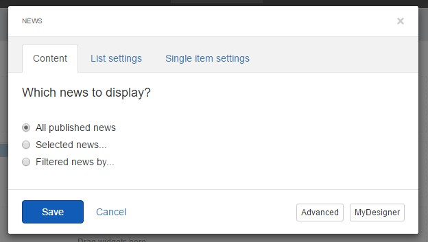
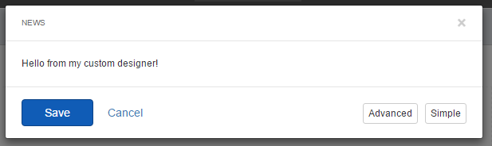

Widget Designers
----------------

> When building custom widgets, you likely have a set of properties that
> need to be set by editing the properties of the widget on the page.
> Sitefinity does provide a default editor interface for your widgets,
> exposing any public properties for edit. However, this editor is a
> simple one, showing only a textbox input for all fields, regardless
> their underlying type.

> Previous to Feather, Sitefinity Thunder attempted to improve things by
> generating designers based on existing widgets, creating the code
> files and templates necessary to render more interactive inputs and
> selectors. However, the components required were numerous and
> cumbersome, and the generated code was verbose and error prone.

> Fortunately, all of this is alleviated with the introduction of
> Feather, which adds a complete framework for creating designers for
> your widgets. Like most of the customization provided by Feather, it
> relies on conventions for naming and placing your designer templates
> in the right location.
>
> Widget Designers Naming Convention
>
> The naming convention for widget designers is similar to the frontend
> portion of the widget template we've already seen, but the prefix for
> the view is "DesignerView". To demonstrate this, we'll create a very
> simple MVC widget designer for the news widget.
>
> Now that we have a widget with some properties, let's proceed to
> create a designer.

1.  Navigate to the path *\~/Mvc/Views*.

2.  Create a new folder called *News*.

3.  Create a file in the folder named *DesignerView.MyDesigner.cshtml*.

4.  Add the following markup to the file's contents:

> *\<p\>Hello from my custom designer!\</p\>*
>
> To see the custom designer in action, open a page which contains the
> news widget and click *Edit* to manage its properties. This action
> reveals the standard designer, but at the bottom of the default
> designer will be a new button pointing to your custom template.

> Clicking it will load that designer into the editor.

#### Note: 
> Although this sample reveals how simple it is to create and
> modify a custom designer, it obviously lacks all the operation
> necessary to service the backing widget, which is a developer task.
> For more details on how to create a full-featured designer for
> existing and custom widgets, see the Sitefinity for Developers book.
>
#### Prioritizing the Custom Designer

> Instead of making your designer an option, you can configure
> Sitefinity to load your designer by default. To do this, simply create
> a file alongside the template, named to match exactly except using the
> extension .json, and add the following contents:
>
> {
>
> \"priority\": 1
>
> }
>
> For our example, we would create the file
> *DesignerView.MyDesigner.json* and place it in the same folder. Next
> time we load the editor we'll automatically see our custom designer
> template.
