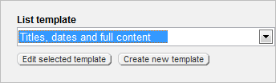
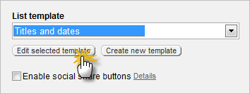
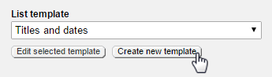
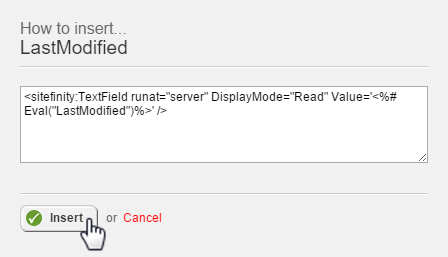
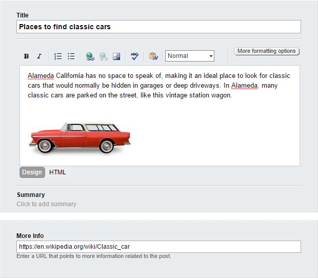
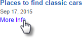
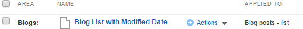

Widget Templates for Legacy Web Forms Technology
------------------------------------------------

What if you don\'t like the way a widget is arranged or the type of
content it contains? Widgets template allow you to tailor the layout.

Accessing Widget Templates
--------------------------

You can access widget templates from the Administration menu and from
the edit link of the widget.

The Administration menu *Design \> Widget templates* option shows the
name of the template and where the template is used. For example, the
*List of threads* template is applied to the Forums threads list.
Click the *Name* link to edit the template.

The *Edit* link of the allows you to select a template and then edit
it, or create an entirely new template.

Changing a Template
-------------------

This next walk-through assumes you already have one or more blog posts
created. The blogs should have Tags defined.

1.  Drag a *Blog Posts* widget to a page.

2.  Click the widget *Edit* button.

3.  Click the *List Settings* link.

4.  Select the *Titles and dates* template from the drop down list

5.  Click the *Edit selected template* button.

The Edit template page displays three areas: HTML markup, a right hand
insert menu, and the bottom of the page edits for *Template name* and
*Name for developers*.

The HTML markup uses ASP.NET syntax and has special tags that
reference Sitefinity data fields. The *Blogs Insert\...* menu lists
the data that can be dropped right into your widget. To make it easier
to use, the list is divided into *Common data* fields you\'re likely
to use and *Other data* that lists all possible fields. The *Template
name* is used by Sitefinity to identify the template.

To add new data to the template:
--------------------------------

1.  Place your cursor in the HTML just below the PostDate field, as
    shown in the screenshot below.

2.  From the *Blogs Insert\...* menu, click the *Tags* item. Sitefinity
    automatically creates the markup you need. Click the *Insert* button
    to place the markup at the cursor position.

3.  Click the *Save* changes button.

4.  Click the *Save* button.

5.  Now the widget lists the tags below the title and publication date.

Creating a New Template
-----------------------

What happens to your changed template when a new version of Sitefinity
is installed? The template may be overwritten by the new installation.
The recommended approach is to create a new template that will not
conflict with built-in templates. You can copy all the HTML from
another template and then add any fields that you want.

1.  Click the Blog Posts widget *Edit* button.

2.  Click the *List Settings* link.

3.  Select the *Titles and dates template*, then click the *Edit
    selected template* button.

4.  Click the *Restore template to default* button. This rolls back any
    changes you have made to the original definition stored in the
    database.

5.  Click the confirmation *Yes, restore the default version\...*
    button.

6.  Select all the HTML in the editing window, right-click and select
    *Copy* from the context menu.

7.  Click the *Save changes* button.

8.  Click the *Create New Template* button.

9.  Place your cursor in the editing window and paste the HTML from the
    clipboard.

10. Enter a unique, descriptive template name.

11. Click the *Save changes* button. The new template should appear in
    the list of templates where it can be assigned or edited.

12. Select your new template from the List template drop down.

13. Click the *Edit* selected template button.

#### Note: 
Why are we saving, then going back and editing? The
right-hand menu is not populated with blog fields until after the
save.

14. Place your cursor in the HTML just below the PostDate field.

15. From the Blogs Insert menu on the right side, open the *Other data*
    section and click the *LastModified* field. This step displays HTML
    markup that you can insert into your widget template.

16. Click the *Insert* button to paste the generated code into the HTML
    window.

17. Click the *Save changes* button.

18. Click *Save*.

19. Click the *Save* button.

20. The widget with the new template shows the modified date below the
    publication date.

Using Custom Fields in Widgets
------------------------------

Custom fields for pages and content types is listed in the widget
editor, right along with the built-in Sitefinity fields. For example,
custom fields can be added to blog posts, using the Custom Fields for
posts link from the right-hand menu.

For example, a "More Info" field could be added to each blog post that
contains a URL pointing to information relating to the post. The
settings for the custom "More Info" field might look something like
this:

Here's an example blog post that uses the "More Info" custom field, at
the bottom of the page:

You can use the same procedure described in Creating a New
Template, but instead of adding a PostDate, the new MoreInfo field shows up in the right-hand list of blog fields.

When you click the custom field, the *How to insert...* dialog pops up
with markup to display the field as text:

\<sitefinity:textfield runat=\"server\" displaymode=\"Read\"

value=\'\<%\# Eval(\"MoreInfo\")%\>\' /\>

We want to display this as a link so change the markup to use an HTML
anchor \<a\> tag instead:

\<a runat=\"server\" target=\"\_blank\" href=\'\<%\#
Eval(\"MoreInfo\")%\>\'\>More Info\</a\>

The rendered widget adds a new "More info" link. The URL for the link
is defined in the custom field.

Managing Widget Templates
-------------------------

Widget templates are managed from the *Design \> Widget Templates*
menu option. You should be able to see your new widget in this list,
with your login name listed in the *Owner* column. The widgets are
grouped into *Area*. Also notice that the *Applied To* column
indicates where the template is used. To open the widget template for
editing, click the link in the *Name* column.

**Next Topic:**
[Themes for Legacy Web Forms Technology](../Themes/readme.md)