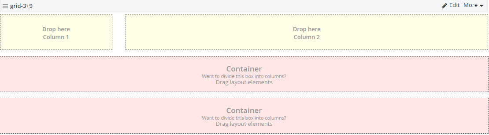
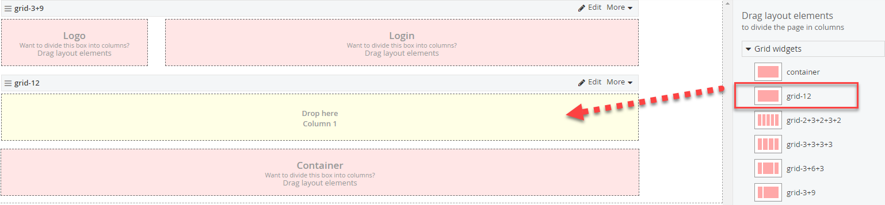
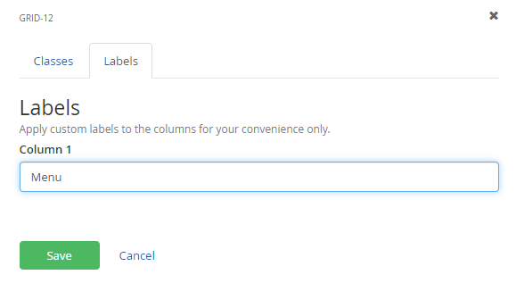
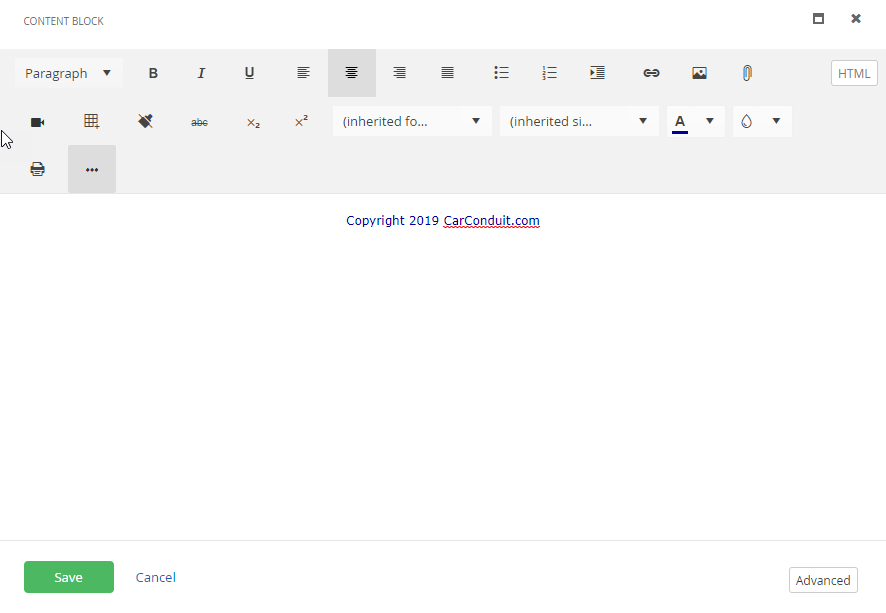
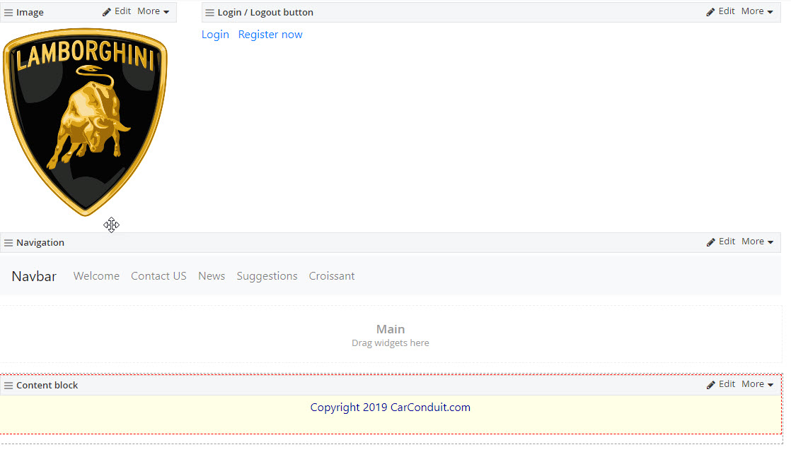
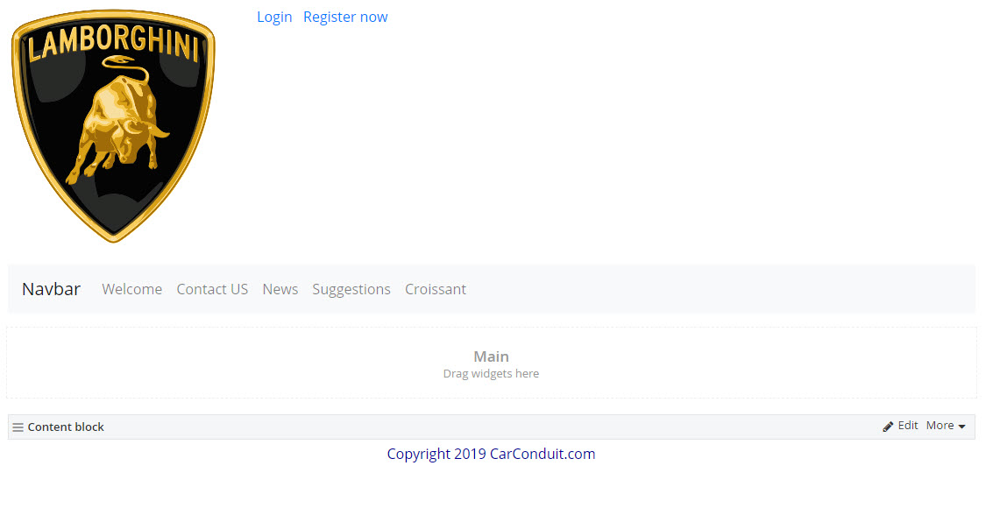
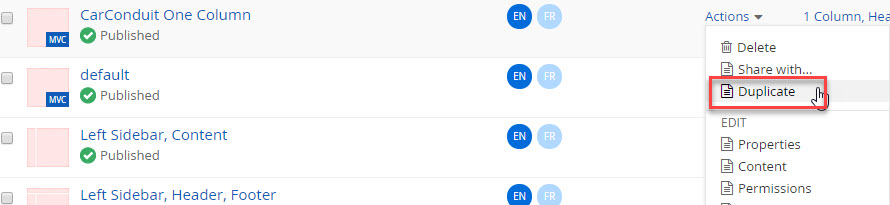
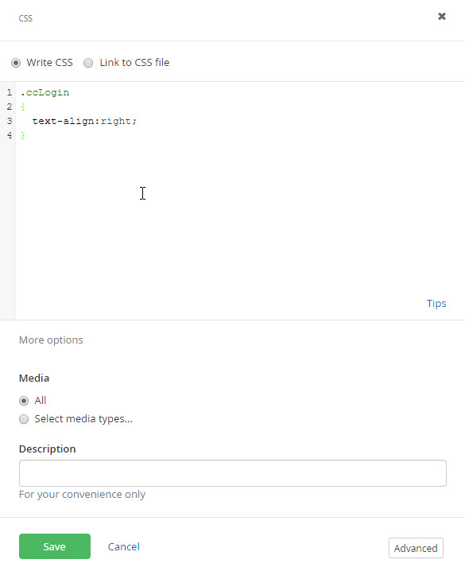
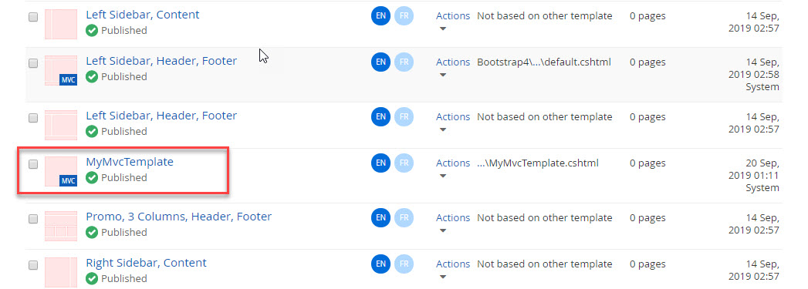
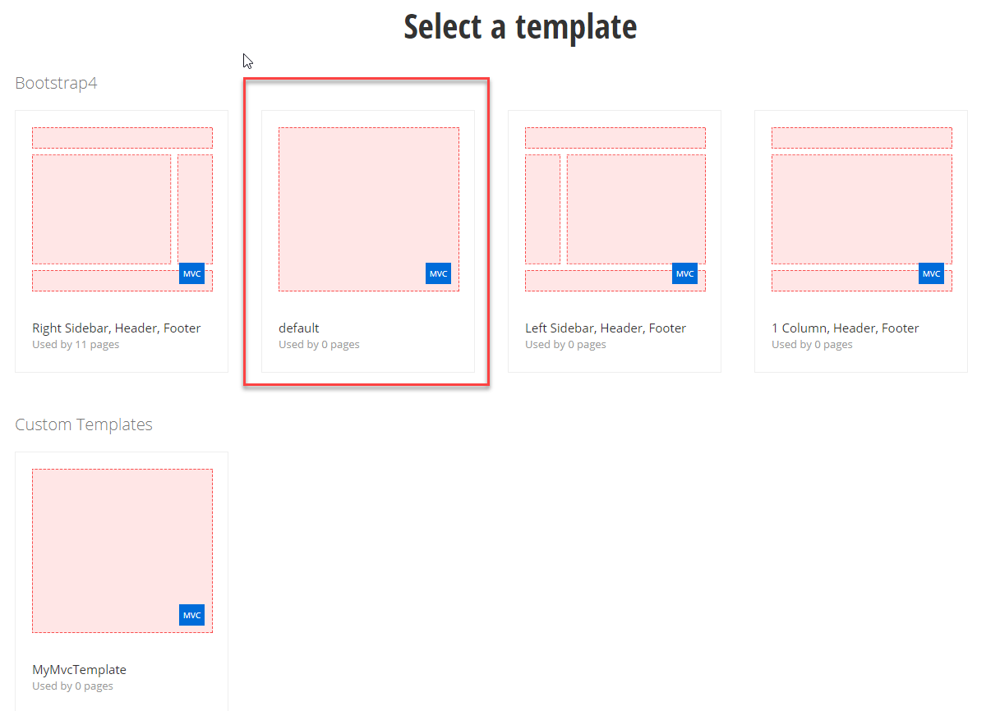

Sitefinity© Designers Workshop
========================================

*©2019 Alain "Lino" Tadros*
>
> All rights reserved. No parts of this work may be reproduced in any
> form or by any means - graphic, electronic, or mechanical, including
> photocopying, recording, taping, or information storage and retrieval
> systems - without the written permission of the publisher.
>
> Products that are referred to in this document may be either
> trademarks and/or registered trademarks of the respective owners. The
> publisher and the author make no claim to these trademarks.
>
> While every precaution has been taken in the preparation of this
> document, the publisher and the author assume no responsibility for
> errors or omissions, or for damages resulting from the use of
> information contained in this document or from the use of programs and
> source code that may accompany it. In no event shall the publisher and
> the author be liable for any loss of profit or any other commercial
> damage caused or alleged to have been caused directly or indirectly by
> this document

Table of Content
================

[Designers](#designers)

[Responsive Web Design](#responsive-web-design)

[Widget Templates](#widget-templates)

[Page Templates](#page-templates)

[Themes](#themes)

[Sitefinity Feather](#sitefinity-feather)

[Creating Page Templates from MVC Layout Files](#creating-page-templates-from-mvc-layout-files)

[Widget Designers](#widget-designers)

> 108 \| DESIGNERS

Designers
=========

> As a designer, you're interested in creating a functional, attractive
> layout for the site. The major concern here is not how to create
> content, configure the site or perform heavy- duty programming tasks.
>
> This section shows how to create responsive web pages that display
> well in any device, design master pages customize the look and feel of
> the entire site and create templates for widgets and pages.
>
> The section ends with a look at the Sitefinity Feather Module, a
> modern, convention- based framework for creating clean,
> mobile-friendly layouts in a simplified manner.

109 \| DESIGNERS

Responsive Web Design
---------------------

> Your web design is expected to look good on standard desktop displays,
> iPhones, Androids, tablets or any device used during the life of your
> website. Sitefinity automatically arranges the layout of the screen
> based on the current screen characteristics (i.e. screen size, device
> to pixel ratio, orientation, etc.). If your large, browser-based
> layout takes up three columns from side to side, the iPhone can view
> the same content running in a single column. You can even customize
> font properties or swap images based on the current screen
> characteristics.
>
> Sitefinity implements responsive web design automatically, using rules
> to define the characteristics to look for (e.g. 240-320 pixels in
> width like the HTC Wildfire) and how your site should react (e.g.
> transform the layout, redirect to another site, or load a special
> CSS).
>
> Under the hood, Sitefinity uses CSS media queries to get information
> about the screen minimum width and orientation. For more background
> information, check out Ethan Marcotte\'s seminal blog [[Responsive Web
> Design]{.underline}.](http://www.alistapart.com/articles/responsive-web-design/)
>
> Creating Rules
>
> The first step is to create rules for the scenarios you expect to
> encounter. In our example, we\'ll create a small version of a simple
> website. You can make rules for as many detailed cases as you want.
> Typically, you\'ll want to cover small \"Smart phone\" screens,
> tablets and large notebook/desktop screens.
>
> To begin building a responsive web site, first create the group rules
> and the layout that should result.

1.  From the Sitefinity menu, select *Design \> Responsive & Mobile*
    design.

2.  Click the *Create a group of rules* button.

3.  Enter a *Name* for the group of rules.

{width="3.901240157480315in"
height="0.9166666666666666in"}

> 110 \| DESIGNERS

4.  Select device characteristics using the presets from the drop-down
    list. For this example, choose the *Smartphones* option.

{width="3.7555555555555555in"
height="1.5916666666666666in"}

5.  Leave the defaults for *Apply behavior to\...* and Specific CSS file
    options.

6.  In the *System settings* section, select the vertical arrangement of
    rows for each option. For example, where the default is *3 colum*ns,
    select *3 rows*.

{width="3.531169072615923in"
height="2.971874453193351in"}

111 \| DESIGNERS

7.  Leave the *This group of rules is active* checkbox selected and
    click the *Done*

> button.
>
> To test this, we can create a new page with a three-column layout,
> then look at the page preview and simply resizing the browser. First
> create a new page that uses the *3 Equal Columns, Header, Footer*
> template.

{width="4.467420166229221in"
height="2.46875in"}

> Add three Image widgets, one for each column. Populate the Image
> widgets with any images you have available.

{width="6.513888888888889in"
height="2.2284722222222224in"}

> 112 \| DESIGNERS
>
> You can test the responsive design simply by resizing the browser. The
> images display side-by-side, horizontally, as long as the browser is
> wide enough.

{width="4.218233814523185in"
height="2.1610411198600175in"}

> Reduce the width of the browser, and the responsive rule for *Small*
> kicks in. *Small* is configured to transform the layout from 3 columns
> to 3 rows when the browser is narrower than a smart phone.

{width="2.367299868766404in"
height="3.1066666666666665in"}

113 \| DESIGNERS

> To get a better feel for how your page will look in a phone or tablet,
> click the *More actions \> Preview for Smartphones & Tablets* option.

{width="3.5308639545056866in"
height="2.1666666666666665in"}

> {width="2.723333333333333in"
> height="5.541666666666667in"}The preview shows how the page appears in
> iPhone, iPad and Samsung, Blackberry, Nokia and an ever-growing list
> of devices as they come on the market. You can also toggle the view
> between portrait or landscape orientations.
>
> 114 \| DESIGNERS
>
> Device Characteristics
>
> Sitefinity predefines a set of device characteristics that will
> trigger layout changes. The likely suspects are listed there, but you
> can add your own custom rules to help \"future proof\" your site.

{width="6.455754593175853in"
height="3.34375in"}

115 \| DESIGNERS

> Click the *Details* button next to the \"High PPI devices\" entry to
> configure the specifics that make up each rule. You can trigger rules
> based on the size or size range, orientation, aspect ratio and
> resolution. You can even trigger rules if the device is an old-school
> monochrome or grid-based device, e.g. teletypes, terminals or portable
> devices with limited display capabilities. As you change the settings,
> a CSS media query is built dynamically in the *Result* area at the
> base of the dialog.

{width="4.069570209973754in" height="6.3525in"}

> 116 \| DESIGNERS
>
> Adding New Behaviors
>
> Changing layout gets you part way there, but you may need to perform
> detailed styling of fonts, hide or show images, change margins or
> obscure elements that don\'t work with a particular device. There are
> two ways to handle these detailed changes, either transform the layout
> or navigate to an entirely different page.
>
> The *Open a specially prepared site* option (e.g. a mobile version of
> your site) is less flexible than using style sheets and may result in
> multiple sites being created as new device types come online. The
> advantage is that you can customize the site very specifically for
> each device type. To go this route, select the *Open a specially
> prepared site* option, then select the Root page of the specially
> prepared site.

{width="6.457738407699038in"
height="2.5104166666666665in"}

> If you select Transform the layout, you can choose a CSS file that
> will come into play when certain devices are detected.

{width="6.393160542432196in"
height="2.4853116797900263in"}

117 \| DESIGNERS

> Using a CSS file option, the page is still single source, but styles
> are applied to customize the page for each situation. The example
> below uses a style sheet to control the look of the full-sized web
> page. The screenshot shows a full-size banner graphic that stretches
> across all three columns.

{width="4.776162510936133in"
height="2.5833333333333335in"}

> When the browser size is reduced to trigger the \"Small\" set of
> rules, the small.css styling displays a smaller graphic at the top of
> the page and a different font than the larger version.

{width="2.8379647856517933in"
height="4.079061679790026in"}

> 118 \| DESIGNERS
>
> Here\'s an example of the small.css file:
>
> .banner\_small {
>
> display: block !important;
>
> }
>
> .banner\_large {
>
> display: none !important;
>
> }
>
> .threeImage { margin-top: 30px;
>
> !important;
>
> margin-bottom: 0px !important; margin-left: 0px !important;
>
> }
>
> h3 {
>
> margin-top: 0px;
>
> !important;
>
> margin-bottom: 0px !important;
>
> }
>
> .blurb {
>
> color: \#3060A0 !important; font-weight: bold !important; margin-top:
> 0px !important; margin-bottom: 0px !important;
>
> }

119 \| DESIGNERS

Widget Templates
----------------

> What if you don\'t like the way a widget is arranged or the type of
> content it contains? Widgets template allow you to tailor the layout.
>
> Accessing Widget Templates
>
> You can access widget templates from the Administration menu and from
> the edit link of the widget.
>
> The Administration menu *Design \> Widget templates* option shows the
> name of the template and where the template is used. For example, the
> *List of threads* template is applied to the Forums threads list.
> Click the *Name* link to edit the template.

{width="5.71875in"
height="1.9819444444444445in"}

> The *Edit* link of the allows you to select a template and then edit
> it, or create an entirely new template.

{width="3.572785433070866in" height="1.0725in"}

> 120 \| DESIGNERS
>
> Changing a Template
>
> This next walk-through assumes you already have one or more blog posts
> created. The blogs should have Tags defined.

1.  Drag a *Blog Posts* widget to a page.

2.  Click the widget *Edit* button.

3.  Click the *List Settings* link.

4.  Select the *Titles and dates* template from the drop down list

5.  Click the *Edit selected template* button.

{width="3.64867782152231in"
height="1.381874453193351in"}

121 \| DESIGNERS

> The Edit template page displays three areas: HTML markup, a right hand
> insert menu, and the bottom of the page edits for *Template name* and
> *Name for developers*.

{width="6.515676946631671in"
height="4.0307283464566925in"}

> The HTML markup uses ASP.NET syntax and has special tags that
> reference Sitefinity data fields. The *Blogs Insert\...* menu lists
> the data that can be dropped right into your widget. To make it easier
> to use, the list is divided into *Common data* fields you\'re likely
> to use and *Other data* that lists all possible fields. The *Template
> name* is used by Sitefinity to identify the template.
>
> 122 \| DESIGNERS
>
> To add new data to the template:

1.  Place your cursor in the HTML just below the PostDate field, as
    shown in the screenshot below.

{width="3.428472222222222in"
height="2.3354166666666667in"}

2.  From the *Blogs Insert\...* menu, click the *Tags* item. Sitefinity
    automatically creates the markup you need. Click the *Insert* button
    to place the markup at the cursor position.

{width="4.145536964129484in"
height="2.3306244531933507in"}

123 \| DESIGNERS

3.  Click the *Save* changes button.

4.  Click the *Save* button.

5.  Now the widget lists the tags below the title and publication date.

{width="2.2066666666666666in"
height="1.1666666666666667in"}

> Creating a New Template
>
> What happens to your changed template when a new version of Sitefinity
> is installed? The template may be overwritten by the new installation.
> The recommended approach is to create a new template that will not
> conflict with built-in templates. You can copy all the HTML from
> another template and then add any fields that you want.

1.  Click the Blog Posts widget *Edit* button.

2.  Click the *List Settings* link.

3.  Select the *Titles and dates template*, then click the *Edit
    selected template* button.

4.  Click the *Restore template to default* button. This rolls back any
    changes you have made to the original definition stored in the
    database.

{width="3.5289162292213474in"
height="1.4495833333333332in"}

> 124 \| DESIGNERS

5.  Click the confirmation *Yes, restore the default version\...*
    button.

6.  Select all the HTML in the editing window, right-click and select
    *Copy* from the context menu.

7.  Click the *Save changes* button.

8.  Click the *Create New Template* button.

{width="3.6034722222222224in"
height="1.0333333333333334in"}

9.  Place your cursor in the editing window and paste the HTML from the
    clipboard.

10. Enter a unique, descriptive template name.

{width="3.738888888888889in"
height="0.7305555555555555in"}

11. Click the *Save changes* button. The new template should appear in
    the list of templates where it can be assigned or edited.

12. Select your new template from the List template drop down.

{width="3.698611111111111in"
height="1.6583333333333334in"}

13. Click the *Edit* selected template button.

> **Note**: Why are we saving, then going back and editing? The
> right-hand menu is not populated with blog fields until after the
> save.

125 \| DESIGNERS

14. Place your cursor in the HTML just below the PostDate field.

15. From the Blogs Insert menu on the right side, open the *Other data*
    section and click the *LastModified* field. This step displays HTML
    markup that you can insert into your widget template.

{width="4.665726159230096in"
height="2.6770833333333335in"}

16. Click the *Insert* button to paste the generated code into the HTML
    window.

17. Click the *Save changes* button.

18. Click *Save*.

19. Click the *Save* button.

20. The widget with the new template shows the modified date below the
    publication date.

{width="2.2083333333333335in"
height="0.8770833333333333in"}

> 126 \| DESIGNERS
>
> Using Custom Fields in Widgets
>
> Custom fields for pages and content types is listed in the widget
> editor, right along with the built-in Sitefinity fields. For example,
> custom fields can be added to blog posts, using the Custom Fields for
> posts link from the right-hand menu.
>
> For example, a "More Info" field could be added to each blog post that
> contains a URL pointing to information relating to the post. The
> settings for the custom "More Info" field might look something like
> this:

{width="4.111175634295713in"
height="2.1354166666666665in"}

127 \| DESIGNERS

> Here's an example blog post that uses the "More Info" custom field, at
> the bottom of the page:

{width="6.453805774278215in"
height="5.645833333333333in"}

> 128 \| DESIGNERS
>
> You can use the same procedure described in [[Creating a New
> Template]{.underline},](#_bookmark27) but instead of adding a
> PostDate, the new MoreInfo field shows up in the right-hand list of
> blog fields.

{width="1.4055566491688538in"
height="2.1041666666666665in"}

> When you click the custom field, the *How to insert...* dialog pops up
> with markup to display the field as text:
>
> \<sitefinity:textfield runat=\"server\" displaymode=\"Read\"
>
> value=\'\<%\# Eval(\"MoreInfo\")%\>\' /\>
>
> We want to display this as a link so change the markup to use an HTML
> anchor \<a\> tag instead:
>
> \<a runat=\"server\" target=\"\_blank\" href=\'\<%\#
> Eval(\"MoreInfo\")%\>\'\>More Info\</a\>
>
> The rendered widget adds a new "More info" link. The URL for the link
> is defined in the custom field.

{width="1.67332239720035in" height="0.78375in"}

129 \| DESIGNERS

> Managing Widget Templates
>
> Widget templates are managed from the *Design \> Widget Templates*
> menu option. You should be able to see your new widget in this list,
> with your login name listed in the *Owner* column. The widgets are
> grouped into *Area*. Also notice that the *Applied To* column
> indicates where the template is used. To open the widget template for
> editing, click the link in the *Name* column.

{width="6.278472222222222in"
height="0.7722222222222223in"}

> 130 \| DESIGNERS

Page Templates
--------------

> Page templates allow you to have the same basic layout and content
> across multiple pages. For example, you may want certain pages to have
> the organization logo in the upper left hand corner and a copyright
> notice centered at the bottom of the page. You can build all of your
> page templates entirely in Sitefinity, using drag and drop, without
> having to use any other tool.
>
> **Note**: Page Templates can also be created [[from master
> pages]{.underline}](#Create_Templates_from_Master_Pages) and [[from
> MVC]{.underline}](#_bookmark33) [[layout
> files]{.underline}.](#_bookmark33)
>
> []{#_bookmark27 .anchor}Access page templates from the *Design \> Page
> Templates* menu option. The list shows built-in templates that can be
> used as starting points.

{width="6.513888888888889in"
height="1.7618055555555556in"}

> The *Title* column opens the template for editing, bypassing the
> *Actions* menu.
>
> The *Actions* menu has options to delete the template, change the
> title, change the content (edit the template), change permissions and
> select a new base template (choose a template as a starting point).
>
> The *Based On* column shows if the template inherits from some other
> template or is completely new.
>
> To the right of Based On, a column shows the number of pages that use
> this particular template. You can click this link to see a list of
> pages that use the template and to preview those pages.

131 \| DESIGNERS

> []{#Creating_a_New_Template .anchor}Creating a New Template
>
> This walk-through demonstrates creating a new page template and
> applying the new template to a page. The template will include an
> organization logo, language selector drop-down, navigation menu and
> footer with a copyright.

1.  Click the *Create a template* button and enter information about the
    template

> Enter the Name of the template. The name should describe how the
> template is used.
>
> Optionally, you can specify a thumbnail image for the template. The
> recommended size is 105 x 80 pixels.

2.  Select the Use template option. Click the *Select another Template*
    button to choose the 1 Column, Header, Footer template.

{width="4.262446412948382in"
height="4.71625in"}

> 132 \| DESIGNERS

3.  Click the *Create and return to Templates* button. The new template
    shows up in the list and the Based On column shows that we\'re using
    the 1 Column Header, Footer template as a starting point.

{width="6.049290244969379in"
height="0.4479166666666667in"}

> Editing the Template Layout
>
> Now that the page template is created, you can fine-tune the template
> layout. This will create the zones that widgets can be dropped into,
> define proportions of areas within layout elements, and define
> "wrapper" names that can be referred to later in CSS.

1.  Click the *Actions \> Content* option (or click the title) to edit
    the template.

2.  Click the *Layout* button. You should see the layout elements from
    the template that this page template is based on.

{width="5.900570866141733in" height="2.805in"}

133 \| DESIGNERS

3.  From the *Drag layout elements* area of the right hand menu, drag
    the 25% + 75% element onto the top row of the layout. This should
    land right on top of the existing layout element.

{width="6.211805555555555in" height="1.775in"}

4.  Now the layout should look something like the screenshot below,
    where the top row is divided into proportions of 25% and 75%.

{width="6.245382764654418in"
height="3.073124453193351in"}

> 134 \| DESIGNERS

5.  Click the *Edit* button, click on *Classes & Labels* and enter
    "Header" as the Wrapper name. Add "ccLogin" to Column 2. In the
    *Labels* area, enter "Logo" for Column 1 and "Login" for Column 2.

> Wrapper is used later to select the entire row in CSS. Column 2 is the
> CSS name for the second column that will contain a login name widget.
> Click the *Done* button to finish editing the layout element.

{width="2.8930653980752408in"
height="4.184791119860018in"}

135 \| DESIGNERS

6.  Drag the 100% layout element to a point just between the top and
    second rows. This will create a new row in the Header area of the
    layout.

{width="6.513888888888889in" height="2.85in"}

7.  Click the *Edit* button, click on *Classes & Labels* and enter
    "Menu" as the Wrapper name and "Menu" as the Column 1 label. Click
    the *Done* button.

{width="2.5701388888888888in"
height="2.8569444444444443in"}

> 136 \| DESIGNERS

8.  Drag a 100% layout element to the Content area below the menu.

9.  Click the *Edit* button, click on *Classes & Labels* and enter
    "Main" as the Wrapper name and "Main" as the Column 1 label. Click
    the *Done* button.

10. Drag a 100% layout element to the Footer area below the content.

11. Click the *Edit* button, click on *Classes & Label*s and enter
    "Footer" as the Wrapper name.

> The layout should look like the screenshot below. Notice that the
> layout elements have the custom labels that you defined.

{width="6.293479877515311in"
height="3.2312489063867016in"}

137 \| DESIGNERS

> Editing the Template Content
>
> Once the layout has been determined, you can add the widgets and
> content that will appear on any page that uses this page template.

1.  Click the *Content* button. Notice that the layout area layouts in
    this view.

{width="6.373611111111111in"
height="2.5819444444444444in"}

2.  Drag an Image widget to the Logo area.

{width="6.020138888888889in"
height="0.8888888888888888in"}

> 138 \| DESIGNERS

3.  Click the *Edit* link.

4.  In the Image dialog, click the *Select image* link, select a logo
    image and click the *Done* button. Click the *Settings* link. Select
    the *Image Size* drop down and select *Small: 240px width* from the
    list. Click the *Save* button.

{width="4.166628390201224in"
height="3.1979166666666665in"}

5.  Open the Login section of the right-hand menu and drag the *Login
    name* widget to the Login layout area.

{width="6.277083333333334in"
height="1.1520833333333333in"}

6.  Click the *Edit* link of the Login name widget. Scroll down to the
    FormatString property and change it to *You\'re logged in as
    {FirstName} {LastName}*. Click the *Save* button.

139 \| DESIGNERS

> The page now displays something like the screenshot below.

{width="5.281944444444444in"
height="2.138888888888889in"}

> **Note**: The Login name should float to the right in this layout. See
> the [[Styling]{.underline}](#Styling) section for directions on how to
> use CSS styling.

7.  From Navigation area of the right-hand menu, drag a *Navigation*
    widget to the Menu layout element below the image and login.

8.  Click the *Edit* button of the Navigation widget. From the template
    drop down, select the *Horizontal with dropdown menus* option. Click
    the *Save* button to close the dialog.

> **Note**: What if you don\'t want to display the home page in the
> navigation, but only the pages that come under home? The Display
> section has an option to display all pages under a particular page.
> Also, you can limit the number of levels to show by setting Levels to
> include.
>
> 140 \| DESIGNERS

9.  Drag a *Content* block widget to the Footer layout area, at the
    bottom of the page.

10. Click the *Edit* link. Add a copyright notice for your organization,
    for example *Copyright 2016 Falafel Software*. Click the *More
    formatting* options button. Place your text cursor just after the
    word Copyright, drop down the list of symbols and select the
    copyright symbol as shown below.

{width="2.5795505249343833in"
height="1.2083333333333333in"}

> Select the text in the editor window, then click the Align Center
> button.

{width="3.0175710848643917in"
height="1.6190616797900264in"}

> Click the *Save* button. The page should now look like the screenshot
> below:

{width="6.045138888888889in" height="2.875in"}

11. Click the *Publish* button.

141 \| DESIGNERS

> **Note**: Widgets in a page template can be marked as editable so that
> they can be tweaked later when they're on the page. For example, if
> you drop an Image widget on the page template, drop down the *More*
> menu and select the *Make editable on pages* option.

{width="2.3020833333333335in"
height="1.9569444444444444in"}

> The widget title bar will display "EDITABLE ON PAGES" to flag the
> change.

{width="2.047222222222222in" height="1.7in"}

> Now you have access to the Edit link even when the widget is used on
> the page. You can change the image choice and the other settings for
> the widget. Be aware that the inheritance to the original widget will
> be broken so that changes to the original will not carry to the page
> where you edited the widget.
>
> 142 \| DESIGNERS
>
> Using the New Page Template
>
> Now that the page template is created and the layout designed, you can
> create a new page using the template.

1.  Select the *Pages* menu option.

2.  Create a new page. In the Template area, select *Use template*, then
    click the *Select another Template* button.

> **Note**: Be aware that changing the template after creating the page
> will \"pull the rug from underneath\" any current page design you
> already have in place.
>
> Changing the template will typically break the layout and you will be
> starting over for that page.

3.  Select the new custom template. Notice the warning that the template
    change may break the existing layout for the page. If this template
    will be used for most of your pages going forward, enable the *Use
    the selected template* as a default template\... option.

{width="4.580555555555556in"
height="3.290277777777778in"}

4.  Click the *Done* button to close the dialog.

143 \| DESIGNERS

> **Note**: You can return to an earlier version of the page, before the
> template was changed by selecting the *Revision History* item from the
> Actions menu.
>
> When you edit the page content, the page appears with the template
> layout and items already showing. Notice that the login name,
> navigation menu and copyright notice all come from the template and
> cannot be changed here. The logo in the upper left corner has
> *Editable in pages* enabled, so the *Edit* link is visible for that
> template element only. You can add new items around the template
> items, but you can\'t delete or sub-divide the layout elements.

{width="6.6in" height="2.95in"}

> 144 \| DESIGNERS
>
> Duplicating Page Templates
>
> {width="1.4299989063867016in"
> height="1.0299989063867017in"}To cut down on repeated work, you can
> duplicate existing page templates. Any changes to the original page
> template are inherited by the duplicate. You can setup hierarchies of
> templates so that page elements are defined one time only. For
> example, you could define a base page with an organization logo. By
> duplicating the
>
> page, you get the organization logo for free.
>
> To create a duplicate, start from *Design \> Page Templates*, then
> click the Actions menu *Duplicate* option. Give the template a new
> title and then select *Create and go to add content* or *Create and
> return to templates*.
>
> Be sure to think ahead about the page templates hierarchy. Try to keep
> the initial templates simple with the minimum number of elements
> needed. Think about the scenarios that might arise and try to design
> your template hierarchy to allow flexibility and maintenance with the
> least amount of upkeep.
>
> []{#Styling .anchor}Styling
>
> Custom changes to fonts, alignment, background and other appearance
> changes needs to be applied using styles. Styles can be added:

-   Using the CSS (Cascading Style Sheet) widget. Styles can be added to
    the widget directly as text or you can link to a CSS file.

-   Using themes. Themes define a set of colors, fonts and CSS for the
    site.

> You can use the CSS widget for quick, ad-hoc styling. You can have as
> many CSS widgets on the page as you like. The styles defined in the
> CSS widget are added automatically to the \<head\> tag of the page.

145 \| DESIGNERS

> The last example shows the Login name widget text aligned left, much
> too close to the logo graphic. The following walk-through demonstrates
> adding a text-align style to the page and using the style in a Content
> block widget.

1.  Select the *Design \> Page Templates* menu option.

2.  Open the CarConduit One Column template created in the previous
    [[Page]{.underline} [
    Templates]{.underline}](#Creating_a_New_Template) section.

3.  Drag a *CSS* widget to the page.

{width="4.8909066054243215in"
height="2.4895833333333335in"}

> **Note**: Where you place the CSS widget is not critical to the
> functioning of the page. The styles in the CSS widget are always added
> to the page \<head\> tag. Multiple CSS widgets appear in the \<head\>
> tag in the order they\'re placed on the page.

4.  Click the CSS widget *Edit* link.

> Take a moment to explore the CSS dialog.
>
> If you choose the *Link to a CSS file* option, you can browse to a
> \*.css file within your project. In the Media section, you can select
> one or more media types that the styles will apply to. CSS files
> should be located in the \\App\_Themes folder.
>
> The *Write CSS* option allows you to add styles directly to the page.
> Styles can be added to the editor window, but be sure to leave out the
> \<style\> tag.
>
> 146 \| DESIGNERS

5.  Select the *Write CSS* option and enter the style below to the
    window:

> .Login
>
> {
>
> text-align:right;
>
> }

6.  Click the *Save* button.

{width="4.257849956255468in" height="2.68in"}

7.  Click the *Preview* button. The top row, right column text should
    align to the right side.

{width="5.353472222222222in"
height="1.6166666666666667in"}

8.  Navigate back to editing the page and click the *Publish* button.

147 \| DESIGNERS

> []{#Create_Templates_from_Master_Pages .anchor}Create Templates from
> Master Pages
>
> Master pages are a file-based standard that ASP.NET uses for
> templating. Master pages also have C\# or VB.NET code-behind unlike
> the Sitefinity template counterpart. Another advantage to master pages
> is that you can reuse whatever frameworks the page is using, such as
> [Bootstrap,](http://getbootstrap.com/) without having to reconfigure
> the page.
>
> Here's a minimal example masterpage with content place holders for the
> top, middle and bottom:
>
> \<%@ Master Language=\"C\#\" AutoEventWireup=\"true\"
> CodeFile=\"MyBasePage.master.cs\" Inherits=\"App\_Master\_MyBasePage\"
> %\>
>
> \<!DOCTYPE html\>
>
> \<html xmlns=\"<http://www.w3.org/1999/xhtml>\"\>
>
> \<head runat=\"server\"\>
>
> \<title\>CarConduit Master Page\</title\>
>
> \</head\>
>
> \<body\>
>
> \<form id=\"form1\" runat=\"server\"\>
>
> \<asp:ScriptManager ID=\"ScriptManager1\"
> runat=\"server\"\>\</asp:ScriptManager\>
>
> \<div\>
>
> \<asp:ContentPlaceHolder ID=\"TheTop\" runat=\"server\" /\>
>
> \</div\>
>
> \<div\>
>
> \<asp:ContentPlaceHolder ID=\"TheMiddle\" runat=\"server\" /\>
>
> \</div\>
>
> \<div\>
>
> \<asp:ContentPlaceHolder ID=\"TheBottom\" runat=\"server\" /\>
>
> \</div\>
>
> \</form\>
>
> \</body\>
>
> \</html\>
>
> The master pages can be located in the *\\App\_Master* directory, a
> sibling of the
>
> *\\App\_Themes* directory. To run in Sitefinity, you must add a
> ScriptManager control inside the form. The ContentPlaceHolder controls
> show up in the Sitefinity page template editor as layout areas.
>
> 148 \| DESIGNERS
>
> To use a master page as a page template:

1.  Click the *Pages* menu option.

2.  Click the *Create a page* button, and provide a name for the page.

3.  In the Template section, click the *Select another Template* button.

4.  Click the *Use your own master file* button.

5.  Select the master page from out of the App\_Master directory, then
    click the *Use Selected* button.

{width="4.200474628171478in"
height="2.756770559930009in"}

6.  Click the *Create and go to add content* button. The
    ContentPlaceHolder areas are shown here with their IDs showing.

{width="6.483548775153106in"
height="1.8885411198600175in"}

149 \| DESIGNERS

Themes
------

> Themes define a set of colors, fonts and CSS for your page templates
> and widgets. To add a theme to your page template:

-   Create a directory structure

-   Add CSS, images and JavaScript

-   Register the theme

-   Apply the theme to the template

> Create a Directory Structure
>
> The screenshot below shows a basic directory structure that will
> successfully contain themes. CarConduit is the root of the
> application, App\_Themes can contain any number of themes, and Global
> contains any CSS that should load automatically.

{width="1.5201279527559055in"
height="0.8731244531933509in"}

> 150 \| DESIGNERS
>
> Add CSS
>
> Create a main.css file in the Global directory and add the styles
> below. Note that the you can name the CSS file anything you want, all
> CSS files in the Global directory will be loaded automatically.
>
> .sfPublicWrapper {
>
> font-family: \"Open Sans\", sans-serif; font-size: 12px;
>
> margin: 20px auto; width: 800px;
>
> }
>
> .Header {
>
> text-align: right;
>
> }
>
> .Footer {
>
> padding-top: 10px; background-color: \#ddd; border: 1px solid \#00f;
>
> }
>
> Register the Theme
>
> Select *Adminstration \> Settings \> Advanced \> Appearance \>
> Frontend themes*. Click the *Create new* button. Enter the name of the
> theme. Enter a path of the theme relative to the root of the website.
> Click the *Save changes* button to finish registering the theme.

{width="4.3902777777777775in"
height="2.9319444444444445in"}

151 \| DESIGNERS

> Apply the Theme
>
> The last step is to apply the theme to the page template. In the Page
> template editor, click the *Theme* button. If path structure and
> configuration are correct, the new theme name should appear in the Set
> Theme drop down list.

{width="2.869992344706912in"
height="2.2333333333333334in"}

> After applying the theme, the styling changes reflect in the page
> appearance.

{width="6.475130139982502in"
height="4.366561679790026in"}

> 152 \| DESIGNERS
>
> Tips for Using Master Pages
>
> You will need to perform some \"surgery\" to make the theme useful in
> Sitefinity. Using master pages inside a Sitefinity website involves
> three main pieces:

-   The master age itself. The master page file and its associated
    code-behind live in the App\_Master folder of the Visual Studio
    project.

-   The theme contains style related files, i.e. css, JavaScript and
    images.

-   The Sitefinity template is stored in the Sitefinity database. The
    template ties together the Master page and the Theme. The template
    is based on the master page and the theme is applied to the
    template. The CarConduit files are included with projects with this
    book.

> In Visual Studio, you will need to edit the master file to work with
> Sitefinity. Once the general areas are setup in the master page, use
> the template in Sitefinity to further subdivide layout elements and to
> add common content. Develop the layout to fit your requirements, then
> create areas for customization using the ContentPlaceHolder control.
>
> Here are some tips for performing "surgery" on the master page:

-   Remove everything from the inside of the \<head\> tag. Sitefinity
    will take care of meta tags and style sheet references for us, so
    the \<head\> tag elements are not needed. You will need the \<head\>
    tag itself, so do not remove it.

-   Add the attribute runat=\"server\" to the \<head\> tag. Sitefinity
    needs to access the head tag at the server and failing to do this
    will cause a \"yellow screen of death\" error.

-   Make sure there is only one \<form\> tag on the page, that it is
    just inside the

> \<body\> tag and that it has the runat="server" attribute and value.

-   Analyze the page looking for areas of the page that have hard-coded
    text. Replace areas of hard-coded text with ContentPlaceHolder
    controls. For example:

> \

>
> \<asp:contentplaceholder id=\"Navigation\" runat=\"server\" /\>
>
> \</div\>
>
> **Note**: Be sure to use *ContentPlaceHolder*, not *Placeholder*.
>
> To make the template general-purpose, add ContentPlaceHolder controls
> to any area of the master page you\'ll want to customize later. Try to
> remove any formatting markup

153 \| DESIGNERS

> that might limit you in the future. When you get done replacing
> various areas of the page, the master page becomes much smaller, only
> consisting of structural markup. You can also remove JavaScript from
> the master page because the widgets will supply script for things like
> menu hover behavior.
>
> 154 \| DESIGNERS
>
> The example below is a simplified example of a master page. Notice the
> areas where the ContentPlaceHolder has been introduced.
>
> \<!DOCTYPE html PUBLIC \"-//W3C//DTD XHTML 1.0 Transitional//EN\"
> [\"http://www.w3.org/TR/xhtml1/DTD/xhtml1-transitional.dtd](http://www.w3.org/TR/xhtml1/DTD/xhtml1-transitional.dtd)\"\>
>
> \<html xmlns=\"<http://www.w3.org/1999/xhtml>\"\>
>
> \<head runat=\"server\"\>
>
> \</head\>
>
> \<body\>
>
> \<form runat=\"server\" id=\"MyForm\"\>
>
> \

>
> \

>
> \<a class=\"logo\" href=\"\#\"\>Site Home\</a\>
>
> \

>
> \<asp:**ContentPlaceHolder** ID=\"MyNavigation\" runat=\"server\" /\>
>
> \</div\>
>
> \</div\>
>
> \

>
> \<asp:**ContentPlaceHolder** ID=\"MyContent\" runat=\"server\" /\>
>
> \</div\>
>
> \

>
> \

>
> \

>
> \<h3\>Testimonials\</h3\>
>
> \

>
> \<asp:**ContentPlaceHolder** ID=\"MyTestimonials\" runat=\"server\"
> /\>
>
> \</div\>
>
> \</div\>
>
> \</div\>
>
> \

>
> \

>
> \<h3\>Recent Comments\</h3\>
>
> \<asp:**ContentPlaceHolder** ID=\"MyComments\" runat=\"server\" /\>
>
> \</div\>
>
> \</div\>
>
> \

>
> \

>
> \<h3\>Recent Posts\</h3\>
>
> \<asp:**ContentPlaceHolder** ID=\"MyPosts\" runat=\"server\" /\>
>
> \</div\>
>
> \</div\>
>
> \

>
> \

>
> \<h3\>Categories\</h3\>
>
> \<asp:**ContentPlaceHolder** ID=\"MyCategories\" runat=\"server\" /\>
>
> \</div\>
>
> \</div\>
>
> \ 

155 \| DESIGNERS

> \

>
> \<asp:**ContentPlaceHolder** ID=\"MyCopyright\" runat=\"server\" /\>
>
> \</div\>
>
> \</div\>
>
> \</div\>
>
> \</form\>
>
> \</body\>
>
> \</html\>
>
> The output for this template might end up looking like the screenshot
> below. The master page ContentPlaceHolder controls supply areas for
> the upper right hand side navigation menu, a content area below that
> and sections for Testimonials, Recent Comments, Recent Posts and
> Categories. The area at the bottom of the page is intended as a space
> for the copyright notice but could hold other page footer content.

{width="5.131423884514436in"
height="2.9895833333333335in"}

> The titles in the footer for Testimonials, Recent Comments, etc., have
> been hard-coded for this discussion. Just the same, you could swap out
> all those titles with more ContentPlaceHolder controls. Later, if
> Categories gets changed to Tags for example, someone without Visual
> Studio experience could still change the content using Sitefinity
> alone.
>
> 156 \| DESIGNERS
>
> Once your template holds a master page and theme, you can simply drop
> widgets into any page that uses the template. The screenshot below
> shows a sample welcome page. To show something of interest in the
> navigation menu, About Us, Blogs and News pages have been created
> underneath the new Welcome page. The logo image is directly from the
> master page markup, while the menu is a Navigation widget dropped into
> the page. Below those two items, the Image Gallery widget displays a
> list of images along with detail for one image. Below the Image
> Gallery, Testimonials and Recent Comments are placed using a simple
> Content block widget. Recent Posts uses a News widget and the Popular
> Tags area holds a Classification \> Tags widget.

{width="5.639814085739283in" height="5.075in"}

157 \| DESIGNERS

Sitefinity Feather
------------------

> The *Sitefinity Feather* module is a collection of resources and
> conventions to simplify the creation and management of widgets,
> layouts, and templates. Feather allows you to use convention-based,
> mobile-first UI frameworks with your Sitefinity site. The most popular
> of all these frontend frameworks is Bootstrap, but Feather also
> supports other frontend framework such as Semantic UI and Foundation.
>
> Feather is a free module, built into Sitefinity and is enabled by
> default on new Sitefinity installations. Feather adds a complete
> framework to take control the site's layout and markup. In this
> section we'll review a few of the features relevant to designers
> provided by Feather.
>
> **Note**: Although the technology behind Feather is the ASP.NET MVC
> development framework, the features available to designers involve
> little to no programming effort and can be leveraged by following the
> required conventions which we'll look at in the next section.
>
> 158 \| DESIGNERS
>
> MVC Stock Widgets
>
> Feather includes a collection of MVC versions of the stock Sitefinity
> widgets such as Blogs, News, Events, etc. These versions are
> lightweight, mobile-friendly, and load quickly with efficient, clean
> markup and can be differentiated from the default widgets in the
> toolbox by the MVC icon in the corner.

{width="6.945138888888889in"
height="3.8270833333333334in"}

159 \| DESIGNERS

> On the backend, the widget designers for the MVC widgets are also
> driven by Feather, resulting in a faster, sleeker interface for your
> content editors.

{width="5.7750940507436574in"
height="5.83625in"}

> 160 \| DESIGNERS
>
> Feather isn't just limited to stock modules. Custom dynamic modules
> created by the module builder also get their own MVC Feather widgets,
> all of which are built with the same mobile-first, responsive design.

{width="6.413421916010499in"
height="3.65625in"}

> Widget Designer Framework
>
> You can create custom widget designers using a brand new framework
> based on AngularJS. Included is a wide assortment of Angular
> Directives that make it simple to enable Sitefinity related field
> controls to your designer, including selectors for Pages, Images,
> Documents and even your custom module items.
>
> The extensibility of widget designers offered by Feather also enables
> you to tap into a rich style collection to simplify your design, and
> even allows you to add custom commands to your widget beyond the
> included Editor.

161 \| DESIGNERS

> Convention-based customization
>
> Feather offers an intuitive convention for customizing and creating
> widget and layout templates. Simply create a file in the proper
> location and the MVC widgets and designers will have immediate access
> to the new templates.
>
> The Bootstrap template package is included out of the box, and
> additional packages supporting Foundation and Semantic UI are also
> available via
> [GitHub.](https://github.com/Sitefinity/feather-packages) You can even
> create your own packages to reuse across multiple Sitefinity websites.
> Sitefinity Page Templates are created from these packages
> automatically, so you can immediately benefit from the new MVC layouts
> on your pages.
>
> Templating via Routing
>
> Feather uses a clever routing technique to make it easy to decide
> which templates to override and from where. Templates assigned from a
> Resource Package have the highest priority, then fall back to the root
> Mvc folder and finally back to the embedded resources, allowing you to
> override some or all templates by simply creating a file in the
> appropriate location.
>
> 162 \| DESIGNERS
>
> Layout Widget Templates
>
> Another feature enabled by the Feather module is the set of layout
> templates from the different UI Resource Packages (Bootstrap,
> Foundation, Semantic UI). These are found in the Template section of
> the sidebar of the page editor, and allow you to apply grids and
> columns to your pages, based on the framework of your choice.

{width="2.8319444444444444in"
height="5.002083333333333in"}

163 \| DESIGNERS

> Resource Packages
>
> Layout templates are actually sourced from a folder in the Sitefinity
> project root named ResourcePackages. Within each package folder is a
> collection of templates that can be automatically assigned to your
> pages, widgets, and designers associated with the pages created using
> the package.
>
> In addition to containing templates, ResourcePackages can also contain
> the styles, scripts, images and other content required to style your
> page. By following a simple naming convention, your page templates
> will automatically be enhanced by the appropriate package.
>
> 164 \| DESIGNERS

Creating Page Templates from MVC Layout Files
---------------------------------------------

> Feather allows you to create Page Templates in the backend based on an
> MVC layout file (instead of the usual Webforms Master Page). Simply
> place a layout file in the appropriate Mvc folder and Feather will
> automatically create the associated Sitefinity page template.
>
> You can then extend the template, adding new ContentPlaceHolders and
> other markup by modifying the appropriate backing layout file.
>
> To demonstrate this, we'll create a new template based on this example
> MVC layout file, named MyMvcTemplate.cshtml
>
> \@using Telerik.Sitefinity.Frontend.Mvc.Helpers
>
> \<!DOCTYPE html\>
>
> \<html xmlns=\"<http://www.w3.org/1999/xhtml>\"\>
>
> \<head\>
>
> \<title\>\</title\>
>
> \</head\>
>
> \<body\>
>
> \<h1\>Template based on Layout file by convention\</h1\>
>
> \

>
> \@Html.SfPlaceHolder(\"Contentplaceholder1\")
>
> \@Html.SfPlaceHolder(\"Contentplaceholder2\")
>
> \@Html.SfPlaceHolder(\"Contentplaceholder3\")
>
> \</div\>
>
> \</body\>
>
> \</html\>
>
> Notice that the layout template defines the full structure of the HTML
> page, and also includes placeholders via the \@Html.SfPlaceholder
> helper method. These placeholders correspond to the droppable widget
> areas on the Sitefinity template.
>
> First, in the project folder for your site navigate to the location
> \~/Mvc/Views and create a folder named Layouts. Then create a file
> named MyMvcTemplate.cshtml and place it in the Layouts folder, so that
> the full path to the file is
>
> \~/Mvc/Views/Layouts/MyMvcTemplate.cshtml.

165 \| DESIGNERS

> In the Sitefinity Administration Backend, navigate to *Design \> Page
> Templates*, revealing the new template in the list, automatically
> added and named to match the layout file.

{width="6.510219816272966in"
height="1.2008333333333334in"}

> Opening the template reveals the three content placeholders, into
> which you can place any of the Mvc Feather widgets. Since we're using
> a custom layout (and not a Resource Package), these widgets will use
> the default markup of the embedded Feather templates.

{width="6.53994094488189in" height="5.185in"}

> These can then be customized by creating the appropriate template
> files in the Mvc folder. We demonstrate this in the section
> [[Customizing the Built-in Widget
> Templates]{.underline}.](#Customizing_the_Built_in_Widget_Template)
>
> 166 \| DESIGNERS
>
> Using Page Templates from Resource Package Layouts
>
> Within the included Bootstrap ResourcePackage is at least one MVC
> layout file, and these files also automatically generate a
> corresponding Sitefinity Page Template in the backend. When using the
> Bootstrap template (or any ResourcePackate template), all Feather MVC
> widgets placed on that template (or pages based on the template)
> automatically inherit the templates defined in that package instead of
> serving the default embedded ones in the Feather package.
>
> To demonstrate this, we'll create a new Sitefinity Page from the
> default Bootstrap template, located in the path
>
> *\~/ResourcePackages/Bootstrap/Mvc/Views/Layouts/default.cshtml.*

167 \| DESIGNERS

1.  In the Administration Backend, navigate to Pages.

2.  Click the *Create a Page* button.

3.  Name the page "My Bootstrap Page".

4.  In the section labeled "Template" click the *Select another
    Template* button.

5.  From the section of templates labeled with the header "Bootstrap"
    select the one named "default".

{width="6.025in" height="5.0784722222222225in"}

6.  Click *Done,* then *Create and Go to Content* to create the page.

> 168 \| DESIGNERS
>
> {width="2.2in"
> height="1.6499989063867018in"}Since this layout is defined to use the
> Bootstrap resource package, any MVC widgets added will automatically
> load the templates from that folder, matching the look and feel of the
> bootstrap style and typography.
>
> You can further customize these by creating the appropriate template
> files in the Resource Package folder. This is demonstrated in the
> section [[Customizing the
> Built-in]{.underline}](#Customizing_the_Built_in_Widget_Template)
> [[Widget
> Templates]{.underline}.](#Customizing_the_Built_in_Widget_Template)
>
> Working with Feather Widgets
>
> We've already seen that enabling Feather adds a complete assortment of
> MVC widgets for the Sitefinity stock and dynamic modules. In this
> section we'll see how we can customize these using the file path
> conventions of Feather.
>
> **Note**: For information on creating your own widgets that leverage
> the MVC Framework, see the Sitefinity 9 for Developers book.

169 \| DESIGNERS

> []{#Customizing_the_Built_in_Widget_Template .anchor}Customizing the
> Built in Widget Templates
>
> If you are not using Resource Packages and have no custom templates
> for any widgets, Feather will default to serving the embedded
> templates in the Feather module library. The templates are presented
> for selection when you edit a widget in the page editor. If no custom
> templates exist, only the default one is available for selection.

{width="6.529491469816273in"
height="4.40489501312336in"}

> However, because these templates are served from the Feather library,
> they are static and cannot be modified. Instead, you can create your
> own custom templates, to be served instead of the defaults. There are
> two ways to manage these: either in the Sitefinity Widget Template
> editor in the Administration Backend, or by creating actual files that
> follow the Feather file path conventions.
>
> []{#Order_of_Virtual_Path_Resolution .anchor}Order of Virtual Path
> Resolution
>
> As previously mentioned, there are several locations from which widget
> templates can be served using Feather, with rules that prioritize some
> locations over others. Here is the list of possible places from the
> highest priority (served first) to the lowest (served when no other
> higher-priority templates exist):
>
> 170 \| DESIGNERS

-   **ResourcePackages**: If the backing Page or Page Template that
    contains the widget is based on an MVC template from a Resource
    Package, it will first search the Mvc folder of that package on the
    file system and serve the matching templates for each widget found
    in that location. If you are not using a Resource Package template,
    this area is skipped and not searched.

-   **Root Mvc folder**: If no matching templates are defined in the
    Resource Package Mvc folder (or if the template is not based on a
    Resource Package) Feather will attempt to locate views in the root
    \~/Mvc/Views folder of the web application.

-   **Sitefinity Widget Templates**: If no matching templates are
    defined in the file system, Feather will then search for a matching
    template in the backend list of templates (located under the
    Design \> Widget Templates menu).

-   **Embedded Resources**: Finally, if no custom templates are found in
    any of the custom locations, Feather will serve the default,
    embedded resources from the Feather module itself.

> Creating Templates in the Sitefinity Backend
>
> Sitefinity maintains a list of widget templates that are stored in the
> database so you can manage them from the backend. These are listed in
> the section found under [[Designers]{.underline}](#_bookmark25)
>
> [[\> Widget Templates]{.underline}.](#_bookmark25)
>
> By default, Sitefinity does not provide custom MVC templates for stock
> widgets, so the list is initially populated only with templates for
> the standard (Webform) widgets.
>
> Creating new templates for MVC widgets requires that you follow the
> naming convention for the widget, by prefixing the name of the
> template with the type of view to which it is assigned in the format
> {ViewType}.{TemplateName}.
>
> This name must also identify the type of view being shown, for example
> List.MyTemplate would represent a template for the list view, while
> Detail.MyTemplate would represent another template for the details
> page.
>
> We'll demonstrate this by creating new MVC templates for the News
> widget. For the markup we'll use a copy of the template files from the
> Bootstrap resource package (located in the folder
> \~/ResourcePackages/Bootstrap/MVC/Views/News).

171 \| DESIGNERS

> Here is the markup for the list view, modified with a custom title to
> differentiate from the default template.
>
> \@model Telerik.Sitefinity.Frontend.Mvc.Models.ContentListViewModel
>
> \@using Telerik.Sitefinity.Frontend.Mvc.Helpers;
>
> \@using Telerik.Sitefinity.Modules.Pages;
>
> \@using Telerik.Sitefinity.Web.DataResolving;
>
> \<h1\>My Custom List View\</h1\>
>
> \

>
> \<ul class=\"list-unstyled\"\>
>
> \@foreach (var item in Model.Items)
>
> {
>
> var navigateUrl = HyperLinkHelpers.GetDetailPageUrl(item,
> ViewBag.DetailsPageId, ViewBag.OpenInSamePage);
>
> \<li \@Html.InlineEditingAttributes(Model.ProviderName,
> del.ContentType.FullName, (Guid)item.Fields.Id)\>
>
> \<h3\>
>
> \<a \@Html.InlineEditingFieldAttributes(\"Title\", \"ShortText\")
> href=\"\@navigateUrl\"\>\@item.Fields.Title\</a\>
>
> \</h3\>
>
> \<div\>
>
> \
>
> \@item.GetDateTime(\"PublicationDate\", \"MMM d, yyyy, HH:mm tt\")
>
> \@Html.Resource(\"By\")
>
> \@DataResolver.Resolve(item.DataItem, \"Author\", null)
>
> \</span\>
>
> \@Html.CommentsCount((string)navigateUrl, item.DataItem)
>
> \</div\>
>
> \
 \"ShortText\")\>
>
> \@Html.Raw(item.Fields.Summary)
>
> \</div\>
>
> \<a href=\"\@navigateUrl\"\>\@Html.Resource(\"FullStory\")\</a\>
>
> \</li\>
>
> }
>
> \</ul\>
>
> 172 \| DESIGNERS
>
> \@if (Model.ShowPager)
>
> {
>
> \@Html.Action(\"Index\", \"ContentPager\", new
>
> {
>
> currentPage = Model.CurrentPage, totalPagesCount =
> Model.TotalPagesCount.Value,
>
> redirectUrlTemplate = ViewBag.RedirectPageUrlTemplate
>
> })
>
> }
>
> \</div\>
>
> And here is the markup for the details view, again slightly modified:
>
> \@model Telerik.Sitefinity.Frontend.Mvc.Models.ContentDetailsViewModel
>
> \@using Telerik.Sitefinity.Frontend.Mvc.Helpers;
>
> \@using Telerik.Sitefinity.Web.DataResolving;
>
> \<h1\>My Custom Detail View\</h1\>
>
> \

> \@Html.InlineEditingAttributes(Model.ProviderName,
> Model.ContentType.FullName, (Guid)Model.Item.Fields.Id)\>
>
> \<h3\>
>
> \
>
> \@Model.Item.Fields.Title
>
> \</span\>
>
> \</h3\>
>
> \<div\>
>
> \
>
> \@Model.Item.GetDateTime(\"PublicationDate\", \"MMM d, yyyy, HH:mm
> tt\")
>
> \@Html.Resource(\"By\")
>
> \@DataResolver.Resolve(\@Model.Item.DataItem, \"Author\", null)
>
> \</span\>
>
> \@Html.CommentsCount(\"\", \@Model.Item.DataItem)
>
> \</div\>
>
> \

>
> \@Html.Raw(Model.Item.Fields.Summary)
>
> \</div\>
>
> \

>
> \@Html.Raw(Model.Item.Fields.Content)
>
> \</div\>

173 \| DESIGNERS

> \@if (Model.EnableSocialSharing)
>
> {
>
> \@Html.SocialShareOptions()
>
> }
>
> \@Html.CommentsList(\@Model.Item.DataItem)
>
> \</div\>
>
> 174 \| DESIGNERS
>
> The following steps walk you through creation and assignment of the
> widget templates.

1.  Click the *Create a template* button.

2.  In the following screen select the option for *News (MVC)*.

3.  Copy and paste the markup from the above template into the editor.

4.  Make sure the name of the template is prefixed with "List." followed
    by a unique name.

5.  Leave the name for developers at its default value.

6.  Click *Create this template*.

7.  Repeat steps 1-6, using the prefix "Detail." in step 4.

8.  Open or create a page in the Page Editor to contain the news widget.

9.  From the toolbox, drag the News widget with the MVC icon into a
    placeholder.

10. Click *Edit* in the newly placed widget to open its property editor.

11. Click the header for List settings, revealing the custom template
    option.

12. Select this template.

13. Click the header for Single item settings, revealing the custom
    template option.

14. Select the custom template.

15. Click *Save*.

> Creating Templates in the File System
>
> While the widget templates section in the Sitefinity backend offers a
> quick and easy way to manage templates, it lacks Intellisense and the
> version control benefits offered by working with actual files.
> Fortunately, by following the Feather naming convention you can manage
> your templates as files in your project.
>
> The naming convention requires that you place the view in a folder
> that matches the name of the widget (such as "News", "Events",
> "VideoGallery", etc.) and name the file to match the type of view
> being served. For example, if you are creating a custom template for
> the News widget list view named "MyTemplate", you would name the file
> *List.MyTemplate.cshtml*.

175 \| DESIGNERS

> There are two locations into which you can place templates, depending
> on whether or not you are using ResourcePackage layouts. If the page
> on which you are adding the widget is based on a Sitefinity Page
> Template using a ResourcePackage layout, you would place your custom
> template in the subfolder of the ResourcesPackage that matches the
> package being used.
>
> **Note**: although you can edit the existing Resource Package
> templates, this is not recommended, as they may be overwritten when
> upgrading Sitefinity or Feather. It is recommended that you create
> custom templates instead of modifying the default ones.
>
> To demonstrate this, we'll create a custom template for the News
> widget list view for a page that is using the Bootstrap Resource
> Package by duplicating and renaming the existing template.

1.  In Visual Studio Solution explorer, navigate to the path

> *\~/ResourcePackages/Bootstrap/MVC/Views/News*.

2.  Right click the file named *List.NewsList.cshtml* and select *Copy*.

3.  Right-click the parent News folder and select Paste.

4.  Rename the file to *List.MyBootstrapTemplate.cshtml*.

5.  Open the newly created file and make changes to differentiate it
    from the default template.

6.  Create or open a Sitefinity page which uses a Bootstrap template,
    and add the MVC News widget.

7.  Click *Edit* on the widget to open the property page.

8.  Click the *List Settings* header, revealing your new template in the
    *List template*

> dropdown.

9.  Select the new template and click *Save*.

> 176 \| DESIGNERS
>
> If your site is not using a Resource Package for layout, you can still
> create custom templates for MVC widgets. Instead of placing the files
> in the ResourcePackages folder, place them in the root MVC folder.
>
> We'll demonstrate this by creating a custom template for the NewsList
> template for a regular Sitefinity page. We'll use the same file from
> the Bootstrap package as a starting point.

1.  In Visual Studio Solution explorer, navigate to the path

> *\~/ResourcePackages/Bootstrap/MVC/Views/News*.

2.  Right click the file named *List.NewsList.cshtml* and select *Copy*.

3.  Navigate to the folder *\~/MVC/Views* and create a new folder named
    *News*.

4.  Right click this folder and select *Paste*.

5.  Rename the file to *List.MyCustomTemplate.cshtml*.

6.  Open the newly created file and make changes to differentiate it
    from the default template.

7.  Create or open a Sitefinity page which does not use a Resource
    Package template, and add the MVC News widget.

8.  Click *Edit* on the widget to open the property page.

9.  Click the *List Settings* header, revealing your new template in the
    *List template*

> dropdown.

10. Select the new template and click *Save*.

> Notice that in this case we did not see the Bootstrap version of the
> template in the list. The Resource Package templates are only revealed
> by Feather if the host template is assigned to a layout file from the
> same package. In this case, we were working with a standard blank
> template, so the naming convention will check the root MVC folder
> instead (see [[Order of Virtual Path
> Resolution]{.underline}](#Order_of_Virtual_Path_Resolution) for more
> details).

177 \| DESIGNERS

> Feather Widgets for Custom Modules
>
> Sitefinity Feather also supports custom modules built with the Module
> Builder. When Feather is installed, it automatically generates an MVC
> widget in the page editor toolbox for any new modules you create.
>
> In this screenshot, I've created a new module called *MyItems*.
> Feather automatically created a matching section in the toolbox,
> allowing me to drag the content widget for this module onto the page.

{width="6.438709536307962in"
height="3.2391666666666667in"}

> 178 \| DESIGNERS
>
> The generated widget has properties similar to all the standard
> Sitefinity widgets, which you can manage by opening the widget
> properties editor. This allows you to specify the standard properties
> you expect, such as filtering items, as well as styling both the list
> and details views for displaying items from the module.

{width="5.377083333333333in"
height="2.9833333333333334in"}

> Editing Custom Module Widget Templates
>
> In addition to creating a widget specific for your module, Feather
> also generates default templates for List and Detail views. You can
> view and edit these templates in the Sitefinity backend by navigating
> to *Design \> Widget Templates*.

{width="6.865277777777778in"
height="3.0868055555555554in"}

179 \| DESIGNERS

> Notice that you get both the standard WebForms version as well as the
> new Feather- friendly MVC templates. Also, the naming of the templates
> must match the expected convention (List.MyItems and Detail.Myitems)
> so that they are presented appropriately for selection in the widget
> properties.
>
> Click to open the *List.MyItem* template, revealing the markup for
> that view. You can manage the markup here, accessing the properties of
> the content item using the pattern *item.Fields.\<FieldName\>* where
> FieldName matches exactly the name of the custom field you wish to
> show. For example, *\@item.Fields.Title* in the screenshot below.

{width="6.422099737532808in"
height="6.389166666666667in"}

> 180 \| DESIGNERS
>
> If the default widget templates are not sufficient to meet your needs
> you can create additional ones with this editor, as well as in your
> Visual Studio solution, by following the same naming and path
> conventions as discussed in the previous section.

Widget Designers
----------------

> When building custom widgets, you likely have a set of properties that
> need to be set by editing the properties of the widget on the page.
> Sitefinity does provide a default editor interface for your widgets,
> exposing any public properties for edit. However, this editor is a
> simple one, showing only a textbox input for all fields, regardless
> their underlying type.

{width="6.281944444444444in"
height="4.683333333333334in"}

> Previous to Feather, Sitefinity Thunder attempted to improve things by
> generating designers based on existing widgets, creating the code
> files and templates necessary to render more interactive inputs and
> selectors. However, the components required were numerous and
> cumbersome, and the generated code was verbose and error prone.

181 \| DESIGNERS

> Fortunately, all of this is alleviated with the introduction of
> Feather, which adds a complete framework for creating designers for
> your widgets. Like most of the customization provided by Feather, it
> relies on conventions for naming and placing your designer templates
> in the right location.
>
> Widget Designers Naming Convention
>
> The naming convention for widget designers is similar to the frontend
> portion of the widget template we've already seen, but the prefix for
> the view is "DesignerView". To demonstrate this, we'll create a very
> simple MVC widget designer for the news widget.
>
> Now that we have a widget with some properties, let's proceed to
> create a designer.

1.  Navigate to the path *\~/Mvc/Views*.

2.  Create a new folder called *News*.

3.  Create a file in the folder named *DesignerView.MyDesigner.cshtml*.

4.  Add the following markup to the file's contents:

> *\<p\>Hello from my custom designer!\</p\>*
>
> To see the custom designer in action, open a page which contains the
> news widget and click *Edit* to manage its properties. This action
> reveals the standard designer, but at the bottom of the default
> designer will be a new button pointing to your custom template.

{width="6.436996937882765in"
height="3.640311679790026in"}

> 182 \| DESIGNERS
>
> Clicking it will load that designer into the editor.

{width="6.430591644794401in"
height="1.9166666666666667in"}

> **Note**: Although this sample reveals how simple it is to create and
> modify a custom designer, it obviously lacks all the operation
> necessary to service the backing widget, which is a developer task.
> For more details on how to create a full-featured designer for
> existing and custom widgets, see the Sitefinity for Developers book.
>
> Prioritizing the Custom Designer
>
> Instead of making your designer an option, you can configure
> Sitefinity to load your designer by default. To do this, simply create
> a file alongside the template, named to match exactly except using the
> extension .json, and add the following contents:
>
> {
>
> \"priority\": 1
>
> }
>
> For our example, we would create the file
> *DesignerView.MyDesigner.json* and place it in the same folder. Next
> time we load the editor we'll automatically see our custom designer
> template.
